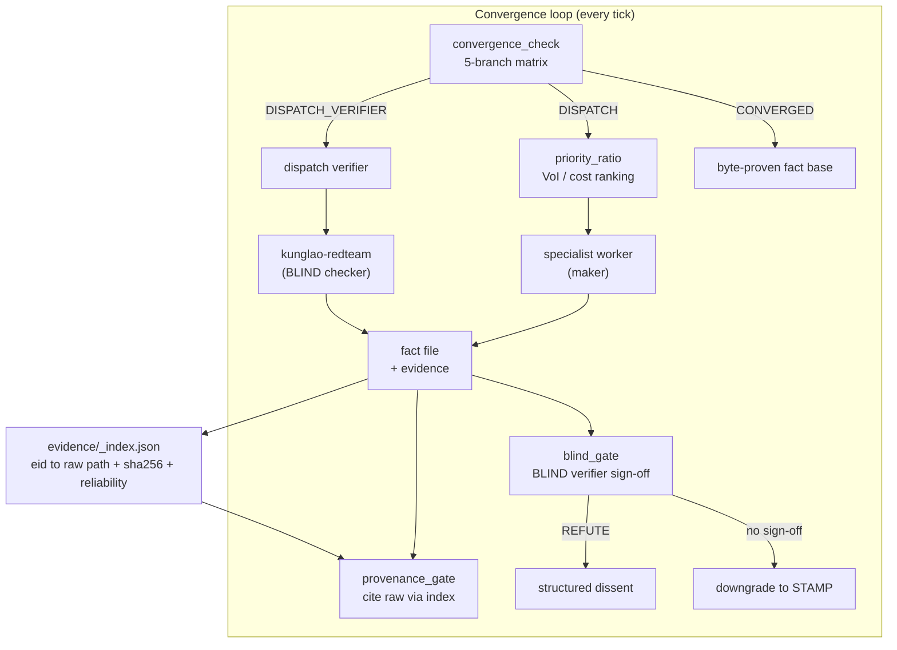

# kunglao-agent

> **Convergence-driven reverse-engineering orchestrator** — an autonomous loop that takes a malware sample to a byte-proven, independently-verified fact base, with a non-lossy evidence chain.
>
> Formerly `kong-agent`. Built on Claude Code (skills + agents + hooks).

[](https://github.com/amd2g2zz/kunglao-agent/actions/workflows/release-check.yml) [](.) [](.)

---

## Why

Most "agent" RE tools are **notification-driven** — they act when poked (worker notification / user prompt), then idle with open claims and free slots. Every "it's stuck / 傻等 / not converging" complaint traces to this. kunglao-agent inverts it: the loop is **convergence-driven**. Every tick it mechanically asks *"should I dispatch, or am I converged/saturated/blocked?"* and acts on the answer. The orchestrator is a daemon, not a one-shot.

The deeper problem it solves: **autonomous output is untrustworthy by default**. An LLM maker self-stamps `PROVEN`, cites a derivation instead of raw evidence, declares `CONVERGED` without answering the primary questions. kunglao-agent makes the two trust preconditions **mechanically enforceable**:

1. **Verified convergence** — `PROVEN` ≡ passed an independent BLIND verifier; `CONVERGED` ≡ all primary questions answered with byte-proof + zero orphan claims + zero false-flatline.
2. **Evidence integrity** — every fact's provenance traces through an evidence index to a **complete raw artifact** (capture / trace / dump / binary); derivations (`summary.json`, `correlated.json`) cannot impersonate evidence; ICD-203 tradecraft conformance (source reliability, 7-tier probability, recorded dissents).

---

## What it does

Given a mounted sample (`bins/<sha256>`) + a task spec, kunglao-agent runs an autonomous loop:

```
mount sample → seed claims (from primary questions) → convergence loop:
  every tick: convergence_check → DISPATCH / DISPATCH_VERIFIER / SATURATED / BLOCKED / CONVERGED
  DISPATCH:  priority_ratio ranks open claims (VoI proxy / cost) → dispatch specialist worker
  worker (maker): gathers byte evidence → writes fact file
  verifier (BLIND checker): forward-derives from raw evidence → pass only on exact match
  gates: doubt_checker / provenance_gate / blind_gate / completeness_gate
CONVERGED: report built on a byte-proven, independently-verified, evidence-indexed fact base
```

It is **not** an analyst — it never decompiles/emulates/scans itself. It orchestrates specialist worker agents (ghidra-light, floss-filter, pefile-signature, cti-correlator, kunglao-worker) and an adversarial verifier (kunglao-redteam). Maker-checker holds: worker = maker, redteam = checker, **different agents**.

---

## Key features

| Feature | What it means |
|---|---|
| **Convergence-driven loop** | 5-branch decision matrix (`convergence_check.py`); never idles with open claims + free slots |
| **VoI priority scoring** | `score = [0.45·L + 0.30·D + 0.25·N] / cost` — leverage (graph topology) + discriminator + novelty / tier cost. **Zero LLM in scoring** (pure mechanical) |
| **BLIND maker-checker** | Verifier gets ONLY raw evidence + question; derives forward; pass on exact match. `PROVEN` requires sign-off, else auto-downgrade to `STAMP` |
| **Verified convergence** | `CONVERGED` requires all primary questions PROVEN + zero orphan terminal claims + SPINNING flatline detection |
| **Evidence index** | `evidence/_index.json` registers every raw artifact (eid → path + sha256 + type + source reliability). Derivations excluded — they are computations, not evidence |
| **Provenance gate** | A fact citing a derivation (`summary.json`) instead of indexed raw → **rejected**. Kills the C-020 "summary-drifts-from-source" failure mode |
| **ICD-203 tradecraft** | Admiralty source reliability per evidence (A1–F6); 7-tier probability ladder; BLIND `REFUTE` recorded as structured dissent |
| **Heartbeat liveness** | Dispatch gate reads `max(last_tick, activity_ts)` — tool activity keeps the loop alive even when the cron isn't ticking |
| **8 independent CLIs** | `kunglao.py` + `kunglao-decide / verify / record / monitor / digest / init / eval` — single-responsibility, no shared argparse |

---

## Architecture



### The two trust layers

**Layer 1 — Verified convergence** (`PROVEN` / `CONVERGED` are mechanically trustworthy):

| Gate | Enforces |
|---|---|
| `blind_gate` | `PROVEN` requires independent verifier sign-off; self-sign rejected; else `STAMP` |
| `convergence_completeness` | `CONVERGED` requires primary_q all `PROVEN` + zero orphan terminal claims |
| `convergence_health` | SPINNING flatline detection (count-based valve, can't be flooded) |
| `heartbeat` (F1+F2) | Loop runs to true completion without false-death halts |

**Layer 2 — Evidence integrity** (the evidence behind `PROVEN` is non-lossy + compliant):

| Gate | Enforces |
|---|---|
| `evidence/_index` | Raw artifacts registered; derivations excluded |
| `provenance_gate` | Fact must cite indexed raw (path + sha256); derivation-only → rejected |
| source reliability | Every evidence entry carries Admiralty rating (mechanical default + verifier-check) |
| confidence schema | 7-tier probability ladder (ICD-203 #2); legacy 3-tier auto-mapped |
| dissent recording | BLIND `REFUTE` produces structured dissent (ICD-203 #8) |

---

## Installation

### Prerequisites

| Requirement | Why | Version |
|---|---|---|
| **Claude Code** | kunglao-agent is a Claude Code skill (runs as the orchestrator loop) | latest |
| **Python** | Scripts, hooks, gates, evidence tooling | 3.11+ |
| **uv** | Python env + dependency management (`pyproject.toml` / `uv.lock`) | latest |
| **git** | Worktree-based dev + state checkpointing | 2.30+ |
| **Ghidra** (optional) | Static decompile/disasm via MCP bridge or `analyzeHeadless.bat` | 11+ |
| **Analysis VM** (optional) | Dynamic dispatch (sample execution / Frida / x64dbg) — never on host | Windows 10/11 |

### 1. Install the skill

kunglao-agent is a Claude Code skill. Clone it into the skills directory:

```bash
git clone https://github.com/amd2g2zz/kunglao-agent.git ~/.claude/skills/kunglao-agent
cd ~/.claude/skills/kunglao-agent
uv sync --locked              # restore .venv from uv.lock — pyyaml / pefile / capstone / jsonschema
```

`uv sync --locked` requires only a clean clone: the dependency set is declared in
`pyproject.toml` and pinned in `uv.lock`, both revision-owned (issue #80 release
contract — see [Release contract](#release-contract)).

Install the worker + verifier subagents (they live alongside, in `~/.claude/agents/`):

```bash
# kunglao-worker (maker) + kunglao-redteam (BLIND checker) ship with the repo
cp agents/kunglao-worker.md ~/.claude/agents/
cp agents/kunglao-redteam.md ~/.claude/agents/
# optional specialists
cp agents/ghidra-light.md floss-filter.md pefile-signature.md cti-correlator.md ~/.claude/agents/
```

### 2. Wire hooks (orchestrator-only, per workspace)

The enforcement gates (worker_budget, heartbeat, dispatch_gate) are PreToolUse/PostToolUse hooks. They are **not** auto-installed — wire them explicitly per workspace:

```bash
python ~/.claude/skills/kunglao-agent/scripts/hook_activation.py <workspace> --wire-up      # idempotent hook registration
python ~/.claude/skills/kunglao-agent/scripts/hook_activation.py <workspace> --heartbeat-on # register .heartbeat.json
python ~/.claude/skills/kunglao-agent/scripts/hook_activation.py <workspace> --reconcile    # rebuild active_workers from worktrees
```

### 3. (Optional) MCP servers + VM

| Capability | MCP server | Notes |
|---|---|---|
| Static decompile / xref / disasm | `ghidra` | bridge at `127.0.0.1:8089`; falls back to `analyzeHeadless.bat` |
| Dynamic stepping | `x64dbg` | **VM-only** — `connect_remote(host=<VM IP>, ...)`; host channel forbidden |
| Runtime hooking | `frida` | **VM-only** — `192.168.20.128:1337` |
| CTI lookup | `virustotal` | needs `VT_API_KEY` |

VM control goes through the `vmr-shell` skill (`VMR_SERVER_URL=http://192.168.20.128:9876`). Sample execution on the host is blocked by the `block_malware_exec` hook — this is intentional.

---

## Release contract

The checked-out revision IS the release artifact. Three revision-owned pieces make a clean clone reproducible (issue #80):

- **`pyproject.toml` + `uv.lock`** — the dependency set actually imported by the codebase (`pyyaml` / `pefile` / `capstone` / `jsonschema`; `pytest` in the dev group), pinned by a committed lockfile. `uv sync --locked` is the documented install command.
- **`release-manifest.yaml`** — the DECLARED inventory: version, dependencies, every shipped agent asset (`agents/*.md`), hook, template, the 8-CLI inventory, and the router subcommand surface. Adding a shipped asset without declaring it here fails CI.
- **`scripts/release_receipt.py`** — the OBSERVED inventory: generates a machine-readable receipt (`release-receipt.json`) with revision, lockfile digest, per-asset sha256, CLI `--help` exit codes, and test result. Run it locally with `--check` for a fast manifest/CLI gate, or point it at a junit XML (`--pytest-junit`) to reuse a pytest run.

CI (`.github/workflows/release-check.yml`) runs this on every PR/push to `dev`/`master`: `uv sync --locked` → `release_receipt.py --check` → the standard test command → uploads the receipt as a workflow artifact.

**Test counts and "shipped" claims in this README are NOT hand-maintained** — the source of truth is the release receipt artifact on the latest CI run. Verify a fresh clone like CI does:

```bash
uv sync --locked
uv run python scripts/release_receipt.py --check
uv run python -m pytest -q
uv run python scripts/kunglao_eval.py --oracle-selfcheck
```

---

## Usage

### Workspace layout

kunglao-agent operates on a **workspace** (one per sample engagement):

```
<workspace>/
├── bins/<sha256>              # the sample (gitignored, never committed)
├── task_spec.yaml             # primary_questions / scope / constraints / depth / success_criteria
├── claim-register.yaml        # all claims (C-NN) with status (OPEN/PROVEN/STAMP/...)
├── claim_deps.yaml            # claim DAG + competitor_groups (for ACH)
├── facts/                     # byte-anchored facts (F-NNN-*.md) + _INDEX.md
├── evidence/                  # raw evidence + _index.json (eid → path + sha256 + reliability)
├── notes/                     # analysis notes (note-NNN.md)
├── runs/                      # worker-status, ledgers, .heartbeat.json, digest.md
└── CLAUDE.md                  # workspace rules (V1–V5: CTI non-truth, sandbox non-conclusion, ...)
```

### Initialize

```bash
# scaffold a fresh workspace + mount sample + seed claims from task_spec primary_questions
python scripts/kunglao-init.py <workspace>
```

`kunglao-init` is idempotent (detects `[initialized]` marker; `--force` to rebuild with backup).

### Run the convergence loop

In Claude Code, invoke the skill:

```
/kunglao-agent
```

or describe the task — it auto-triggers on phrases like *"分析这个样本"* / *"kunglao-agent stuck"* / *"不收敛"*. The orchestrator then runs autonomously:

1. **Cold start** — reads `claim-register.yaml` + `facts/_INDEX.md` + digest (≤38K tokens, not full progress).
2. **Every tick** — `convergence_check.py <workspace>` returns a decision:

   | Decision | Exit | Orchestrator action |
   |---|---|---|
   | `DISPATCH` | 1 | `priority_ratio` ranks open claims → dispatch top specialist worker |
   | `DISPATCH_VERIFIER` | 2 | dispatch BLIND verifier for partial facts |
   | `SATURATED` | 3 | poll stuck workers, do not idle |
   | `BLOCKED` | 4 | resolve blockers (self-recovery L1→L2→L3), then re-check |
   | `CONVERGED` | 0 | loop done — write report |

3. **Worker** (maker) gathers byte evidence → writes `facts/F-NNN.md` + `runs/worker-status-<id>.md`.
4. **Verifier** (kunglao-redteam, BLIND) forward-derives from raw evidence → sign-off or `REFUTE` (→ dissent).
5. **Gates** enforce: `provenance_gate` (cite raw not derivation), `blind_gate` (PROVEN needs sign-off), `completeness_gate` (CONVERGED needs all primary_q PROVEN + zero orphan).
6. **Loop** until `CONVERGED` — output is a byte-proven, independently-verified, evidence-indexed fact base.

### Monitor

```bash
# at-a-glance progress
python scripts/progress_report.py <workspace>

# is the loop actually converging, or spinning?
python scripts/convergence_health.py <workspace>

# worker status (all workers)
cat <workspace>/runs/worker-status-w*.md

# evidence coverage (BLIND + source reliability)
python tools/measure_blind_coverage.py <workspace> --reliability
```

### Dispatch contract (when the orchestrator dispatches)

```
[T1 tools=grep,xxd] claim C-007 <task>     # prefix parsed by worker_budget hook
```
- `T1`/`T2`/`T3` = cheap / medium / expensive (emulation / VM)
- `tools=` = the tools the worker may use (enforced)
- Gates: ≤3 concurrent workers, per-claim cap, tier gate, heartbeat-alive, self-cap detection.

### Example output

A `PROVEN` fact (`facts/F061-c401-ep-recheck.md`):

```yaml
id: F061
status: VERIFIED-BY-W01-static-byte-recheck
confidence: almost_certain        # ICD-203 7-tier (P4)
claim_id: C-401
provenance:
  - {role: sample, path: bins/<sha>}
  - {role: capture_log, path: runs/c329-inner-pe.bin}   # cited via evidence/_index.json
reproduce: |
  python -c "import struct; d=open('runs/c329-inner-pe.bin','rb').read(); ..."
verifier_sign_off:                 # BLIND (M1) — required for PROVEN, else STAMP
  verifier: kunglao-redteam
  verdict: CONFIRMED
  derived_via: [struct.parse, pefile, capstone]   # ≥2 independent paths
```


### CLI reference

| CLI | Job |
|---|---|
| `kunglao.py` | Orchestrator entry (subcommand router: `decide` / `tick` / `verify` / `record` / `health`) |
| `kunglao-decide` | M1 DECIDE — convergence decision + VoI ranking |
| `kunglao-verify` | M3 VERIFY — L1 mechanical + L2 BLIND verifier |
| `kunglao-record` | M4 RECORD — ledger (idempotent event append) |
| `kunglao-monitor` | M5 MONITOR — tick output / worker status |
| `kunglao-digest` | Mechanical 6-section digest (cold-start compression) |
| `kunglao-init` | Idempotent workspace init (anti-double-init) |
| `kunglao-eval` | Eval harness (oracle 10/10 self-check + three-arm + fault injection) |

Every CLI in this table is receipt-validated (see [Release contract](#release-contract)): existence + `--help` exit 0 are checked mechanically on each CI run.

---

## Project structure

```
kunglao-agent/
├── SKILL.md                 # Operative contract (what the orchestrator does)
├── DESIGN.md                # Full design
├── scripts/                 # 55 modules: convergence_check, priority_ratio, blind_gate,
│                            #   provenance_gate, heartbeat_*, convergence_health, ...
├── hooks/                   # worker_budget (M2 gate), heartbeat_touch, dispatch_gate, ...
├── tools/                   # build_evidence_index, audit_legacy_proven, measure_blind_coverage, ...
├── tests/                   # TDD suite (RED → GREEN per feature; counts in release receipt)
├── references/              # 19 protocol docs (convergence-loop, guardrails, RE library, ...)
├── schemas/                 # Frozen JSON schemas (decide/verify/tick/event output)
├── specs/                   # Per-phase contracts (phase-3.5/4/5)
├── openspec/                # SDD change proposals + spec deltas
├── docs/refactor/           # Design docs + research (loop-engineering, refactor-plan, ...)
├── .claude/PRPs/prds/       # Product requirements (verified-convergence, evidence-integrity)
└── templates/               # Workspace scaffolds (claim-register, task_spec, failure-registry)
```

---

## Development workflow

Built **SDD (OpenSpec) + TDD**, one-issue-one-PR-one-branch-one-worktree, merged to `dev` then released to `master`.

```bash
# Per feature:
git worktree add .worktrees/<name> -b <name> dev
openspec new change <name>           # scaffold change proposal
# RED: write failing test → GREEN: minimal impl → refactor
python -m pytest -q                  # baseline counts in the release receipt (CI artifact)
openspec validate <name>
gh pr create --base dev              # squash-merge, delete branch, close issue
```

Every change has an OpenSpec proposal (`openspec/changes/<name>/`: proposal + design + tasks + spec delta). The two PRD-driven iterations:

- **verified-convergence** (`.claude/prds/verified-convergence.prd.md`) — 4 milestones, shipped
- **evidence-integrity-icd203** (`.claude/PRPs/prds/evidence-integrity-icd203.prd.md`) — 5 phases, shipped

---

## Status

**Shipped** (master):
- ✅ 6-phase refactor (cleanup / VoI priority / digest / eval harness / 8-CLI convergence / acceptance)
- ✅ verified-convergence (BLIND gate / completeness gate / heartbeat F1+F2 / legacy audit)
- ✅ evidence-integrity (evidence index / provenance gate / source reliability / probability+dissent / re-verify audit)
- ✅ release contract: revision-owned manifest + lockfile + agent assets, receipt-validated CLI surface, clean-env CI (test counts in the release receipt)

**Known gaps (honest)**:
- 46 legacy `PROVEN` claims audited (10 have-raw / 18 derivation-only / 19 unverifiable) — actual re-verification is follow-up work
- ICD-203 conformance is partial (tradecraft #1/#2/#5/#8/#9 addressed; full certification out of scope)
- `provenance_gate` parser needs hardening on real-workspace frontmatter YAML (has frontmatter-first fallback)
- Dynamic dispatch (VM detonation / Frida) requires user authorization per session

---

## Design docs & research

- [`docs/refactor/loop-engineering.md`](docs/refactor/loop-engineering.md) — loop-engineering research (LangChain 4-loop / DSD 10-pattern / cobusgreyling), kunglao loop assessment, heartbeat bug code-level root cause
- [`docs/refactor/refactor-plan.md`](docs/refactor/refactor-plan.md) — the v2.0 refactor plan (G1–G5 goals)
- [`docs/refactor/design-spec.md`](docs/refactor/design-spec.md) / [`module-design.md`](docs/refactor/module-design.md) — architecture + module contracts
- [`docs/refactor/audit-2026-08-10.md`](docs/refactor/audit-2026-08-10.md) — legacy PROVEN traceability audit

---

## Safety constraints

- **Samples never executed on host** — `block_malware_exec` PreToolUse hook enforces; VM-only via `vmr-shell`
- **Bins / settings / hooks never committed** (`.gitignore`); secrets excluded
- **Ground truth hierarchy**: raw artifact > local tool > sandbox > CTI. CTI is falsifiable claim, never truth (per CLAUDE.md V3)
- **Maker-checker**: worker never self-verifies; verifier never reads the maker's conclusion

---

## License

MIT
