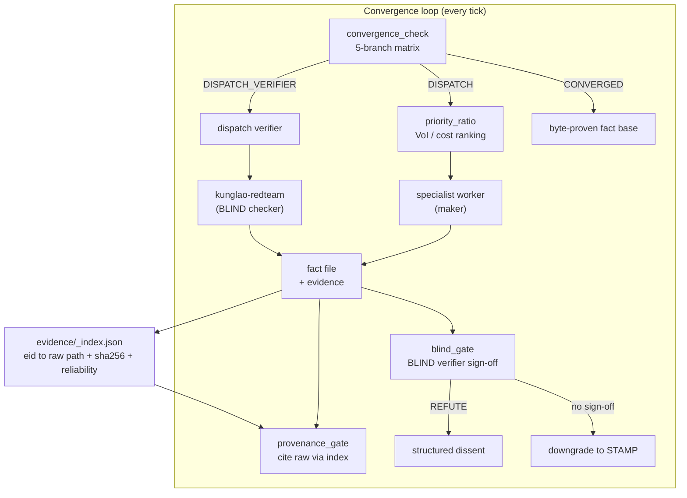

# kunglao-agent

> **Convergence-driven reverse-engineering orchestrator** — an autonomous loop that takes a malware sample to a byte-proven, independently-verified fact base, with a non-lossy evidence chain.
>
> Formerly `kong-agent`. Built on Claude Code (skills + agents + hooks).

[](.) [](.) [](.)

---

## Why

Most "agent" RE tools are **notification-driven** — they act when poked (worker notification / user prompt), then idle with open claims and free slots. Every "it's stuck / 傻等 / not converging" complaint traces to this. kunglao-agent inverts it: the loop is **convergence-driven**. Every tick it mechanically asks *"should I dispatch, or am I converged/saturated/blocked?"* and acts on the answer. The orchestrator is a daemon, not a one-shot.

The deeper problem it solves: **autonomous output is untrustworthy by default**. An LLM maker self-stamps `PROVEN`, cites a derivation instead of raw evidence, declares `CONVERGED` without answering the primary questions. kunglao-agent makes the two trust preconditions **mechanically enforceable**:

1. **Verified convergence** — `PROVEN` ≡ passed an independent BLIND verifier; `CONVERGED` ≡ all primary questions answered with byte-proof + zero orphan claims + zero false-flatline.
2. **Evidence integrity** — every fact's provenance traces through an evidence index to a **complete raw artifact** (capture / trace / dump / binary); derivations (`summary.json`, `correlated.json`) cannot impersonate evidence; ICD-203 tradecraft conformance (source reliability, 7-tier probability, recorded dissents).

---

## What it does

Given a mounted sample (`bins/<sha256>`) + a task spec, kunglao-agent runs an autonomous loop:

```
mount sample → seed claims (from primary questions) → convergence loop:
  every tick: convergence_check → DISPATCH / DISPATCH_VERIFIER / SATURATED / BLOCKED / CONVERGED
  DISPATCH:  priority_ratio ranks open claims (VoI proxy / cost) → dispatch specialist worker
  worker (maker): gathers byte evidence → writes fact file
  verifier (BLIND checker): forward-derives from raw evidence → pass only on exact match
  gates: doubt_checker / provenance_gate / blind_gate / completeness_gate
CONVERGED: report built on a byte-proven, independently-verified, evidence-indexed fact base
```

It is **not** an analyst — it never decompiles/emulates/scans itself. It orchestrates specialist worker agents (ghidra-light, floss-filter, pefile-signature, cti-correlator, kunglao-worker) and an adversarial verifier (kunglao-redteam). Maker-checker holds: worker = maker, redteam = checker, **different agents**.

---

## Key features

| Feature | What it means |
|---|---|
| **Convergence-driven loop** | 5-branch decision matrix (`convergence_check.py`); never idles with open claims + free slots |
| **VoI priority scoring** | `score = [0.45·L + 0.30·D + 0.25·N] / cost` — leverage (graph topology) + discriminator + novelty / tier cost. **Zero LLM in scoring** (pure mechanical) |
| **BLIND maker-checker** | Verifier gets ONLY raw evidence + question; derives forward; pass on exact match. `PROVEN` requires sign-off, else auto-downgrade to `STAMP` |
| **Verified convergence** | `CONVERGED` requires all primary questions PROVEN + zero orphan terminal claims + SPINNING flatline detection |
| **Evidence index** | `evidence/_index.json` registers every raw artifact (eid → path + sha256 + type + source reliability). Derivations excluded — they are computations, not evidence |
| **Provenance gate** | A fact citing a derivation (`summary.json`) instead of indexed raw → **rejected**. Kills the C-020 "summary-drifts-from-source" failure mode |
| **ICD-203 tradecraft** | Admiralty source reliability per evidence (A1–F6); 7-tier probability ladder; BLIND `REFUTE` recorded as structured dissent |
| **Heartbeat liveness** | Dispatch gate reads `max(last_tick, activity_ts)` — tool activity keeps the loop alive even when the cron isn't ticking |
| **8 independent CLIs** | `kunglao.py` + `kunglao-decide / verify / record / monitor / digest / init / eval` — single-responsibility, no shared argparse |

---

## Architecture



### The two trust layers

**Layer 1 — Verified convergence** (`PROVEN` / `CONVERGED` are mechanically trustworthy):

| Gate | Enforces |
|---|---|
| `blind_gate` | `PROVEN` requires independent verifier sign-off; self-sign rejected; else `STAMP` |
| `convergence_completeness` | `CONVERGED` requires primary_q all `PROVEN` + zero orphan terminal claims |
| `convergence_health` | SPINNING flatline detection (count-based valve, can't be flooded) |
| `heartbeat` (F1+F2) | Loop runs to true completion without false-death halts |

**Layer 2 — Evidence integrity** (the evidence behind `PROVEN` is non-lossy + compliant):

| Gate | Enforces |
|---|---|
| `evidence/_index` | Raw artifacts registered; derivations excluded |
| `provenance_gate` | Fact must cite indexed raw (path + sha256); derivation-only → rejected |
| source reliability | Every evidence entry carries Admiralty rating (mechanical default + verifier-check) |
| confidence schema | 7-tier probability ladder (ICD-203 #2); legacy 3-tier auto-mapped |
| dissent recording | BLIND `REFUTE` produces structured dissent (ICD-203 #8) |

---

## Quick start

```bash
# 1. Install (uv-managed Python 3.11+)
uv sync

# 2. Initialize a workspace for a sample
python scripts/kunglao-init.py <workspace>   # scaffolds + mounts sample + seeds claims

# 3. Activate hooks + heartbeat (orchestrator-only)
python scripts/hook_activation.py <ws> --wire-up
python scripts/hook_activation.py <ws> --heartbeat-on

# 4. Enter the convergence loop (the orchestrator runs /kunglao-agent)
#    Every tick: convergence_check → dispatch → verify → repeat until CONVERGED
```

### CLI reference

| CLI | Job |
|---|---|
| `kunglao.py` | Orchestrator entry (subcommand router) |
| `kunglao-decide` | M1 DECIDE — convergence decision + VoI ranking |
| `kunglao-verify` | M3 VERIFY — L1 mechanical + L2 BLIND verifier |
| `kunglao-record` | M4 RECORD — ledger (idempotent event append) |
| `kunglao-monitor` | M5 MONITOR — tick output / worker status |
| `kunglao-digest` | Mechanical 6-section digest (cold-start compression) |
| `kunglao-init` | Idempotent workspace init (anti-double-init) |
| `kunglao-eval` | Eval harness (oracle 10/10 self-check + three-arm + fault injection) |

---

## Project structure

```
kunglao-agent/
├── SKILL.md                 # Operative contract (what the orchestrator does)
├── DESIGN.md                # Full design
├── scripts/                 # 55 modules: convergence_check, priority_ratio, blind_gate,
│                            #   provenance_gate, heartbeat_*, convergence_health, ...
├── hooks/                   # worker_budget (M2 gate), heartbeat_touch, dispatch_gate, ...
├── tools/                   # build_evidence_index, audit_legacy_proven, measure_blind_coverage, ...
├── tests/                   # 269 tests (TDD: RED → GREEN per feature)
├── references/              # 19 protocol docs (convergence-loop, guardrails, RE library, ...)
├── schemas/                 # Frozen JSON schemas (decide/verify/tick/event output)
├── specs/                   # Per-phase contracts (phase-3.5/4/5)
├── openspec/                # SDD change proposals + spec deltas
├── docs/refactor/           # Design docs + research (loop-engineering, refactor-plan, ...)
├── .claude/PRPs/prds/       # Product requirements (verified-convergence, evidence-integrity)
└── templates/               # Workspace scaffolds (claim-register, task_spec, failure-registry)
```

---

## Development workflow

Built **SDD (OpenSpec) + TDD**, one-issue-one-PR-one-branch-one-worktree, merged to `dev` then released to `master`.

```bash
# Per feature:
git worktree add .worktrees/<name> -b <name> dev
openspec new change <name>           # scaffold change proposal
# RED: write failing test → GREEN: minimal impl → refactor
python -m pytest -q                  # 269 must stay green
openspec validate <name>
gh pr create --base dev              # squash-merge, delete branch, close issue
```

Every change has an OpenSpec proposal (`openspec/changes/<name>/`: proposal + design + tasks + spec delta). The two PRD-driven iterations:

- **verified-convergence** (`.claude/prds/verified-convergence.prd.md`) — 4 milestones, shipped
- **evidence-integrity-icd203** (`.claude/PRPs/prds/evidence-integrity-icd203.prd.md`) — 5 phases, shipped

---

## Status

**Shipped** (master):
- ✅ 6-phase refactor (cleanup / VoI priority / digest / eval harness / 8-CLI convergence / acceptance)
- ✅ verified-convergence (BLIND gate / completeness gate / heartbeat F1+F2 / legacy audit)
- ✅ evidence-integrity (evidence index / provenance gate / source reliability / probability+dissent / re-verify audit)
- ✅ 269 tests, acceptance PASS, 8 CLIs green

**Known gaps (honest)**:
- 46 legacy `PROVEN` claims audited (10 have-raw / 18 derivation-only / 19 unverifiable) — actual re-verification is follow-up work
- ICD-203 conformance is partial (tradecraft #1/#2/#5/#8/#9 addressed; full certification out of scope)
- `provenance_gate` parser needs hardening on real-workspace frontmatter YAML (has frontmatter-first fallback)
- Dynamic dispatch (VM detonation / Frida) requires user authorization per session

---

## Design docs & research

- [`docs/refactor/loop-engineering.md`](docs/refactor/loop-engineering.md) — loop-engineering research (LangChain 4-loop / DSD 10-pattern / cobusgreyling), kunglao loop assessment, heartbeat bug code-level root cause
- [`docs/refactor/refactor-plan.md`](docs/refactor/refactor-plan.md) — the v2.0 refactor plan (G1–G5 goals)
- [`docs/refactor/design-spec.md`](docs/refactor/design-spec.md) / [`module-design.md`](docs/refactor/module-design.md) — architecture + module contracts
- [`docs/refactor/audit-2026-08-10.md`](docs/refactor/audit-2026-08-10.md) — legacy PROVEN traceability audit

---

## Safety constraints

- **Samples never executed on host** — `block_malware_exec` PreToolUse hook enforces; VM-only via `vmr-shell`
- **Bins / settings / hooks never committed** (`.gitignore`); secrets excluded
- **Ground truth hierarchy**: raw artifact > local tool > sandbox > CTI. CTI is falsifiable claim, never truth (per CLAUDE.md V3)
- **Maker-checker**: worker never self-verifies; verifier never reads the maker's conclusion

---

## License

MIT
