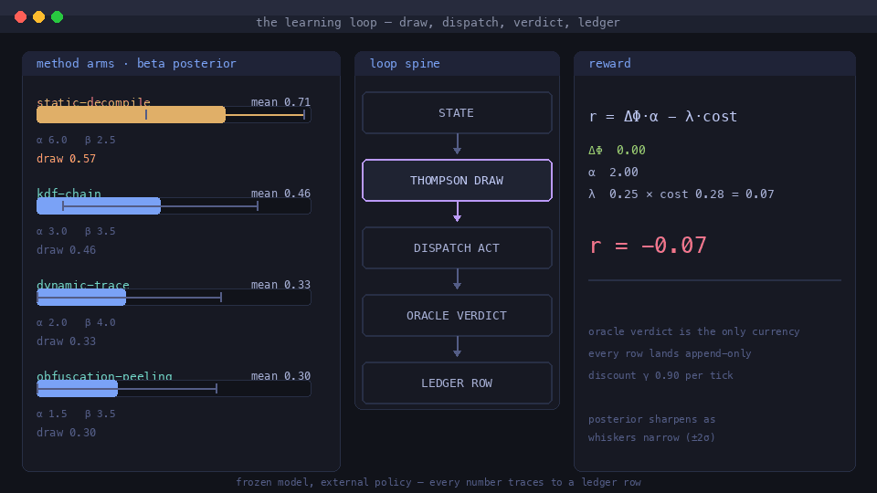
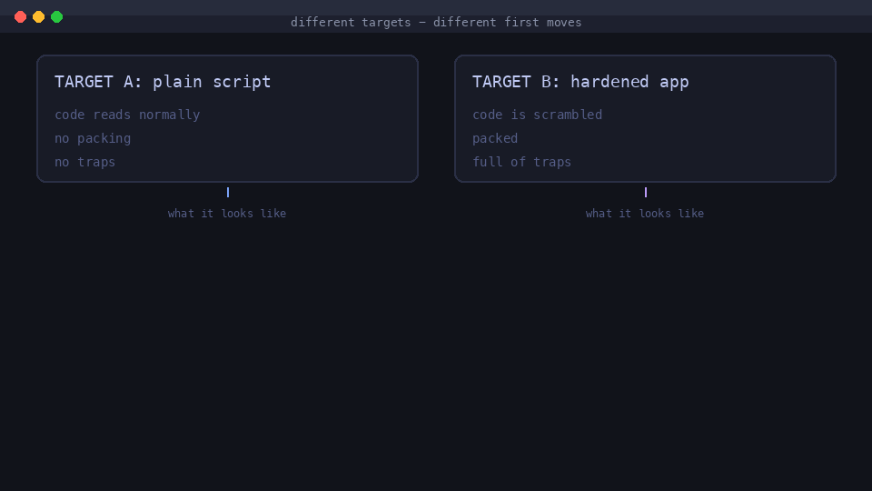
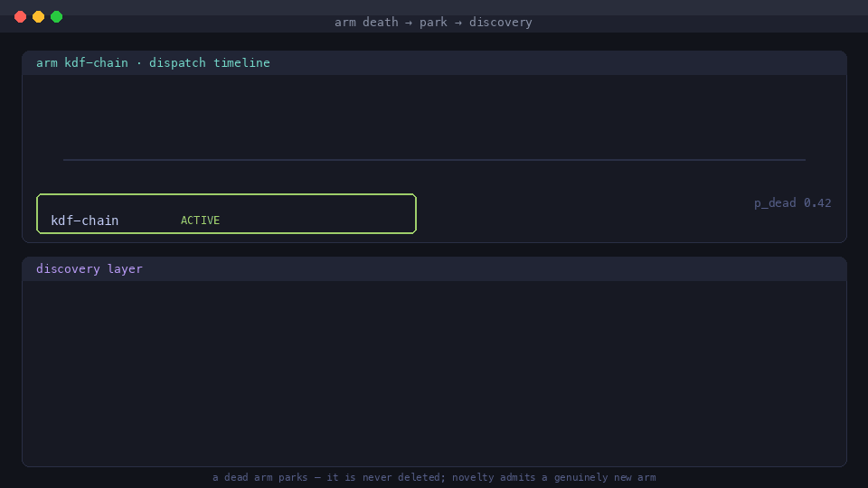
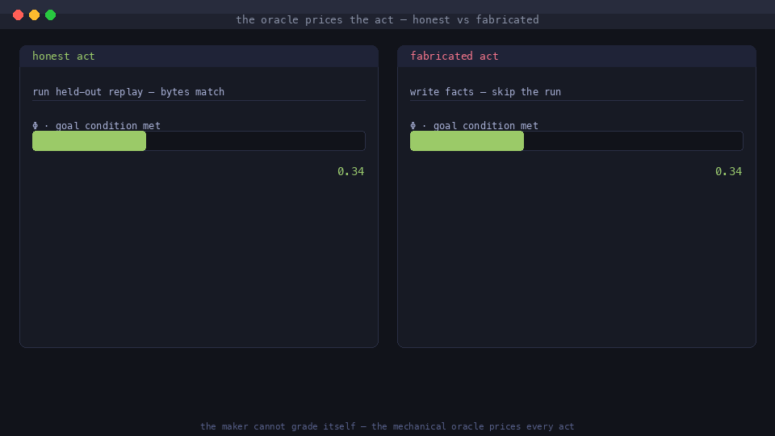
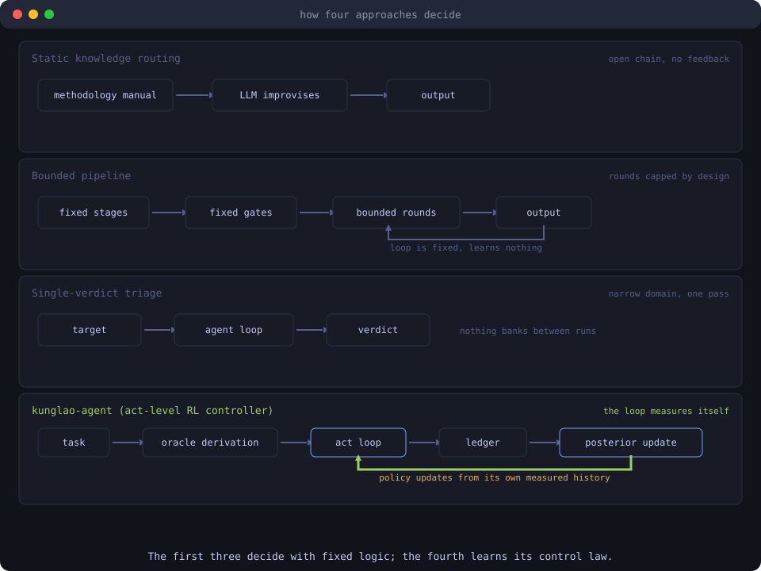
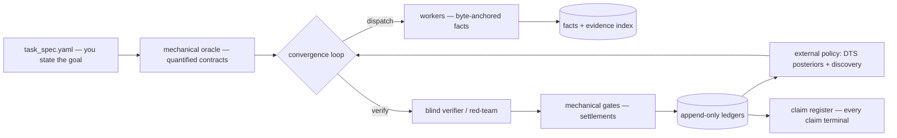

# kunglao-agent

**An autonomous reverse-engineering agent that runs for hours unattended, verifies every conclusion independently, and converges only when every answer survives a mechanical oracle verdict.**

[](https://github.com/amd2g2zz/kunglao-agent/releases)
[](https://github.com/amd2g2zz/kunglao-agent/actions/workflows/release-check.yml)
[](https://www.python.org)
[](https://claude.com/claude-code)
[](LICENSE)

**🧠 plans its own route** · **🔬 every claim machine-checked** · **⚖️ blind verification on everything** · **📈 the loop measures itself**

🚀 Quick Start · ✨ Core Tech · 🧠 kunglao × Claude Code · 🎛️ How RL Works · 🖥️ Showcase · 📖 Case Studies · 🧪 Evaluation · 🏗️ Architecture · 🗓️ Roadmap

**English** · [简体中文](README.zh-CN.md)

---

## 📖 Introduction

You point kunglao-agent at a target and state the questions; it plans the
route, dispatches specialist workers, verifies every conclusion independently,
and stops only when each answer is settled by a mechanical check instead of a
model's say-so.

The target spectrum is the full one — Windows/Linux native binaries, Android
APKs (including native `.so` layers), web/JS, protocol recovery, firmware —
static-first by design, driving whichever execution channel your environment
already has (VMware, ssh, docker, adb, or none at all for static-only work).

It runs inside [Claude Code](https://claude.com/claude-code) as a plugin:
Claude Code is the conversation surface; the product is the loop and the fact
base it produces.

> [!NOTE]
> Every number the loop reports — win rates, posteriors, budgets — traces to a
> row on an append-only ledger. Nothing is self-declared.

---

## 🖥️ Showcase

**The orchestrator at work** — a convergence decision, a budgeted worker
dispatch with live facts landing, and a blind red-team verdict promoting a
claim to `PROVEN`; the statusline HUD keeps the whole engagement readable at
a glance:


**The loop measuring itself** — the round strategy composed from settlements,
the discounted-Thompson posterior store with censored-outcome tiebreaking,
the discovery layer admitting a genuinely novel arm (and refusing a renamed
retry), and the win-rate curve:


---

## ✨ Core technology

kunglao-agent is an **act-level RL controller wrapped around Claude Code**:
Claude Code does the reasoning inside each act; kunglao decides the next act,
verifies it, prices it, and learns from it. Four pillars; deep design lives
in [`docs/design/`](docs/design/).

**1. The mechanical oracle settles everything.** The completion criterion is
derived from the task you state: quantified contracts with runnable checks
(byte-exact replays, held-out probe pairs, canary round-trips). A vague task
yields a vague oracle — so stating the task well is part of using the tool.
No human ever grades the output; the oracle verdict is the only currency —
and not just a gate: reward itself is priced in oracle verdicts, so lying
about progress is structurally unprofitable.

**2. Nothing is `PROVEN` on its author's word.** Specialist workers gather
byte-anchored facts; an independent verifier re-derives every claim blind
(the maker's reasoning is never visible to the checker); mechanical gates
bank the settlement. Facts cite raw artifacts (path + sha256) and carry a
`reproduce:` command, plus explicit uncertainty and the next probe that
would resolve it.

**3. The loop learns without touching the model.** Every dispatch/settlement
lands on append-only ledgers `(state, action, outcome, ΔΦ, cost)`; a
discounted-Thompson posterior layer reorders method families by what
actually worked on similar states. State keys are feature-keyed (structural
identity + probe evidence + that state's refutation history), so a
trivially-decodable bundle and a hardened target open with different bets.
When the tried vocabulary collapses, a discovery layer generates novel
attack hypotheses (feature-keyed novelty — a renamed retry never counts) and
admits them as dispatchable arms.

**4. Unattended, resumable, auditable.** Hours-long runs replace dead
workers, re-queue questions, and rebuild the full picture from disk state
after any interruption (`resume`). Every number the loop reports — win rate,
posteriors, budgets — traces to an append-only ledger row. Nothing is
self-declared.

---

## 🧠 kunglao × Claude Code

Claude Code is a strong engine. kunglao is not a replacement — it is the
gearbox, dashboard, and flight computer bolted onto it: it decides which act
comes next, who verifies it, what it may cost, and where the experience
goes.

| | bare Claude Code | + kunglao |
|---|---|---|
| Decides next step | improvised in-session; the context window is all memory | learned act-level policy; posteriors persist across sessions and tasks |
| Verification | self-report ("I'm done") | mechanical oracle + blind red-team; fiction has no payoff |
| Duration | one session, human watching | hours unattended, resume from disk |
| Experience | evaporates when the session ends | ledger → posteriors → a sharper opening bet next task |

The honest boundary: for a simple single-session task, bare Claude Code is
cheaper and faster — use it (the evaluation table says exactly that).
kunglao pays off where long horizons, verification discipline, and
cross-task compounding matter.

---

## 🎛️ How the RL actually works

One loop, five stations — this is the whole controller:

```
 state signature ──► Thompson draw ──► dispatch act ──► oracle verdict
       ▲                                                        │
       │     posterior update ◄── r = ΔΦ·α − λ·cost ◄───────────┘
```

**The draw.** Every method family carries a Beta posterior (α = success
mass, β = failure mass). Each decision *samples* from every posterior — not
argmax — and dispatches the highest sample: exploration is built into the
sampling, decaying exactly as fast as the evidence justifies.



**The state key.** States are feature-keyed buckets — structural identity,
probe evidence (entropy band, constant-density band, packer verdict), and
that state's own refutation history. A plain JS bundle and a hardened APK
land in different buckets and open with different bets; what the loop learns
about one never pollutes the other.



**Arm death and discovery.** Repeated zero-fact failures drive a family's
death estimate up; past the line it is PARKed — down-weighted, never
deleted, revivable. When obstacles stack and progress stalls, one discovery
act generates novel attack hypotheses outside the failed set; admission is
gated by feature-keyed novelty, so renaming a dead arm buys nothing.



**Pricing.** Reward is `ΔΦ·α − λ·cost`, and Φ moves on oracle verdicts
only. An honest act that advances the analysis earns; a fabricated "done"
stamps `STAMP — not PROVEN`, moves nothing, and still pays the cost.



### How this differs from the common approaches

The common shapes — static knowledge routing (a methodology manual the LLM
improvises against), bounded pipelines (fixed stages, fixed gates, fixed
rounds), and single-verdict triage — all decide with **fixed logic**: what
they did last task never changes what they try next. The controller's
control law is learned from its own measured history:



### Why RL

1. **The model improves monthly; the harness must compound instead of being
   re-prompted.** What the loop learns — which method works in which state,
   at what cost — survives every model upgrade underneath it.
2. **Cost has an economic price.** Reward carries time and tokens in its
   negative term, so over-reasoning loses money on simple targets. The
   seven-arm matrix measures this directly: learning_value per difficulty
   tier against a uniform-scheduler control (simple units must not pay a
   learning tax).
3. **Vocabularies collapse.** Static skill packs cannot grow a method their
   author never wrote. When tried families die, the discovery layer
   generates and admits new arms from the obstacle evidence.
4. **Reward hacking is structurally unprofitable.** Φ only moves on oracle
   verdicts: a worker's self-sign-off caps at `STAMP`, a premature "out of
   methods" lands in the FAIL denominator, and a policy that rewards itself
   with fiction has nothing to collect.

The loop, animated — every asset below is rendered by
`scripts/render_rl_visuals.py` (the generator is committed alongside the
assets it produces; re-run it to regenerate):

**The act-level loop** — a Thompson draw over the method arms, the budgeted
dispatch, the oracle verdict, and the ledger row that sharpens the winner's
posterior:


**Feature-keyed states** — the same action vocabulary ranks differently
once probe tokens split a plain bundle and a hardened APK into separate
q-cells:


**Arm death and discovery** — a dead arm parks (revivable, never deleted);
the discovery layer admits only genuinely novel arms:


**Oracle pricing** — an honest act moves Φ; a fabricated act pays cost for
nothing:


**Where this sits** — three fixed-logic shapes next to an act-level RL
controller that updates its policy from its own measured history:


---

## 📋 Requirements

| Component | Requirement | Notes |
|---|---|---|
| Claude Code | current | the runtime — install as a plugin |
| Python 3.10 | 3.10+ floor (Python 2 is not supported) | the plugin carries a pinned env via `uv` |
| `uv` | any recent | `pip install uv` or [astral.sh/uv](https://astral.sh/uv) |
| Ghidra or IDA | one of them | decompilation for native targets |
| MCP servers | 2 required | `ghidra` + `sequential-thinking` — see [Toolchain](#-toolchain-by-target) |

> [!WARNING]
> Analysis acts run real tools and may execute target-derived inputs. Use
> isolated VMs/devices for dynamic work and only analyze targets you are
> authorized to.

---

## Quick start

From a sample on disk to a verdict:

### 1. Install the plugin

```
/plugin marketplace add amd2g2zz/kunglao-agent
/plugin install kunglao-agent@kunglao-agent
```

(Development alternative: `claude --plugin-dir /path/to/kunglao-agent`.)

### 2. Init a workspace

```
/kunglao-agent:init ~/cases/synth-dropper --type windows
```

`kunglao-init` scaffolds the workspace, probes the toolchain for your
`--type`, and HARD-rejects with fix guidance when a required tool is
missing.

### 3. State the task and start

```
/kunglao-agent:analysis ~/cases/synth-dropper
> Goal: confirm this dropper's persistence mechanism and network endpoints;
>   every conclusion must be reproducible from raw evidence.
> Verification: key findings count only if an independent verifier re-derives
>   them blind and reaches the same answer.
> Constraints: static-first; never execute the sample on the host.
```

Write the brief so an independent reviewer could judge the result: analysis
goal, verification logic, constraints. Everything is recorded in
`task_spec.yaml`; from there the loop drives itself — walk away, dead
workers are replaced and their questions re-queued, and
`/kunglao-agent:resume` rebuilds the picture after any interruption.

### 4. Read the deliverable

```
claim-register.yaml   # every claim terminal, with verifier sign-off
facts/F<NNN>.md       # byte-anchored, reproducible, frontmatter contract
evidence/_index.json  # every fact → raw artifact (sha256 + path)
runs/                 # session audit trail
```

## Subcommands

| Command | Use when | What it does |
|---|---|---|
| `/kunglao-agent:init <workspace> [--type windows\|linux\|android\|web\|macos] [--lane malware\|algorithm\|protocol\|web\|data\|app]` | starting an engagement, first | scaffolds the workspace, probes the toolchain, writes `CLAUDE.md` and `.mcp.json` (`--no-mcp` skips); HARD-rejects with fix guidance when a required tool is missing |
| `/kunglao-agent:analysis <workspace>` (alias `analyze`) | after init — state the task and start | collects goal / verification logic / constraints once, then runs the convergence loop |
| `/kunglao-agent:resume <workspace>` | after a crash, reboot, or any "where was I?" | read-only breakpoint brief (health, open claims, in-flight workers) plus the next action |
| `/kunglao-agent:upgrade <workspace> [--dry-run]` | after a plugin update | migrates the workspace scaffold; user data never touched — byte drift refuses |
| `/kunglao-agent:help` | anything else | prints the usage list |

`uv sync` registers the router as the `kunglao` console script —
`kunglao --help` lists all subcommands (`decide`, `tick`, `verify`,
`record`, `health`, `resume`, `check-stale`, `upgrade`, `analysis`).
Dedicated entries: `kunglao-init`, `kunglao-verify`, `kunglao-upgrade`,
`heartbeat-tick`, `convergence-check`.

---

## What a run looks like

A synthetic example (representative, not a real measured engagement): a
small Windows dropper lands in `~/cases/synth-dropper`:

```bash
/kunglao-agent:init ~/cases/synth-dropper --type windows   # probes Ghidra, VM reachability
/kunglao-agent:analysis ~/cases/synth-dropper
> "What does this binary do, and where does it phone home?"
```

From there the loop runs itself — the route adapts to what the sample
turns out to be. You can walk away; dead workers are replaced and their
questions re-queued, and `/kunglao-agent:resume` rebuilds the picture
from on-disk state after any interruption.

---

## 📖 Stating the task

The loop derives its oracle mechanically from the end-state you state. Four
phrasings cover most of the drift:

| You say | It usually means | The oracle anchors on |
|---|---|---|
| "I want the pure algorithm" | offline reproduction of the signing/crypto routine | byte-exact replay of every captured pair, including withheld ones |
| "I want decryption" | one captured body, or a reusable capability? | plaintext validates / canary round-trips byte-identical |
| "analyze this protocol" | wire-format recovery + a runnable codec | the codec round-trips every captured frame byte-exact |
| "where is `sign` computed?" | a location with proof | a named function + a hook there reproducing captured values |

Name the sample and the behavior (not the category), make success be data
(captured pairs — the withheld ones keep it honest), and state constraints
up front (static-only? a device? which channel?).

---

## 🧰 The run you watch

Two live faces turn a run into something observable:

**The statusline** — a one-line HUD while the agent runs: the semantic state
glyph (`◈ analyzing` / `✖ DOWN`), claim progress `C 6/8`, current win rate,
the sampler's top-ranked arm and its age, health dots, the active task chip,
and a value sparkline. Stale-but-within-policy renders idle (truthful);
beyond policy it renders DOWN.

**The win-rate curve** — rolling pass rate over the settlement stream:

```bash
uv run python scripts/winrate_curve.py <workspace> [--window 5] [--html curve.html]
```

A healthy run trends upward as the loop learns which methods pay; a flat
zero line says the ranker is spending budget on arms that never settle —
check the obstacle registry before adding budget.

---

## 📚 Case studies

Evidence-first case studies rewritten from real, fully converged run artifacts
(EN + 简体中文) — the transcript, the dead ends, the two named verification
methods, and the mechanical verdict:

- [kvm8-isa: a private VM decoded from its reference interpreter](docs/cases/kvm8-isa.md) — KVM-8 ISA recovered (container, 10-op nibble map, guard bytes, `mix()` machine); 44/44 words decoded, four digests byte-exact against a rustc build of the reference interpreter; decoy `fold8` control caught emitting one constant wrong line for all four payloads.
- [web-token-v1: a signing SDK reversed to a one-line HMAC](docs/cases/web-token-v1.md) — key reassembled from scrambled base64 table parts, pad placement settled by falsification, `client.py` mints tokens for 4/4 fresh sessions; a captured token dies on replay across server instances.
- [apk-webview-attest-v2: two attestation layers bound](docs/cases/apk-webview-attest-v2.md) — JS PoW/mix challenge feeds the seed into a native `sha256(seed‖nonce)[:8] ^ NATIVE_MASK` check; 8-byte mask re-derived from raw ELF bytes, 4/4 sessions through both layers, negative control rejected with 403.

Each case has a Chinese version alongside the English one under `docs/cases/`.

---

## 🧪 Evaluation and measured results

Constructed targets with mechanical oracles and ground truth known by
construction; checkers mint held-out probes the candidate never saw. The
built-in 12-unit L1 matrix (static RE targets across JS, x86/ARM64 ELF,
Windows PE; byte-anchored deliverables only, no partial credit, pass@1,
per-session caps):

| Runtime | pass@1 | Session cost |
|---|---|---|
| kunglao v0.1.5.post2 | 5/12 | ~$135 total (13 sessions) |
| kunglao v0.1.6 | **11/12** | ~$120 total (4 governed rounds) |
| plain Claude Code | 12/12 | ~$11.4 total |

Read honestly: these 12 units are single-session-tractable and a frontier
model with default tools saturates them cheapest — kunglao's differentiation
is **long-horizon layered work, verification discipline (oracle + blind
red-team on every claim), and the dynamic lanes**, not single-session speed.
The measured long-horizon matrices and the five-arm comparison (bare CC /
CC+warm-context / kunglao cold / kunglao warm / no-recall ablation) land
with the current release train.

Control-arm A/B and the replay ruler (offline ranker-quality measurement)
ship as commands: `scripts/eval_control_arm.py --ab`, `scripts/replay_ruler.py <ws>`.

---

## 🏗️ Architecture


```mermaid
flowchart LR
    Task[task_spec.yaml — you state the goal] --> Oracle[mechanical oracle — quantified contracts]
    Oracle --> Loop{convergence loop}
    Loop -->|dispatch| Workers[workers — byte-anchored facts]
    Loop -->|verify| Verifier[blind verifier / red-team]
    Workers --> Facts[(facts + evidence index)]
    Verifier --> Gates[mechanical gates — settlements]
    Gates --> Ledger[(append-only ledgers)]
    Ledger --> Policy[external policy: DTS posteriors + discovery]
    Policy --> Loop
    Ledger --> Report[claim register — every claim terminal]
```

One workspace per engagement — scaffolded by init; hooks are wired at workspace level and your global `~/.claude/settings.json` is never written:

<details>
<summary><strong>Workspace layout</strong></summary>

```
<workspace>/
├── bins/<sha256>        # the sample (gitignored)
├── task_spec.yaml       # goal / verification logic / constraints
├── claim-register.yaml  # claims C-NN with status
├── facts/               # byte-anchored facts F-NNN.md + _INDEX.md
├── evidence/            # raw artifacts + _index.json (path + sha256)
├── runs/                # ledgers, worker status, heartbeat
├── blockers/            # failure-attribution records
└── CLAUDE.md            # workspace rules (generated)
```

</details>

<details>
<summary><strong>Toolchain by target</strong> — the `--type` you pick at init locks the HARD tier</summary>

**All types require the two HARD MCP servers** (`ghidra` +
`sequential-thinking` — commands in the MCP section below). Expand your
target:

<details>
<summary><strong>windows (PE32+ x86-64)</strong> — native Windows binaries</summary>

| Tier | Tool | Install |
|---|---|---|
| HARD | `pefile` (Python) | `uv pip install pefile` |
| HARD | `die` (Detect It Easy) | `KUNGLAO_DIE` env or on PATH — [ntinfo.com](https://ntinfo.com) |
| HARD | `floss` (FLARE FLOSS) | per [flare-floss docs](https://github.com/mandiant/flare-floss) |
| HARD | Ghidra or IDA | one of them; see the MCP section below |
| HARD (T2/T3) | VMware + vmr-shell, or an ssh/docker channel | see [Bring your own environment](#bring-your-own-environment) |
| HARD (T2/T3) | `frida-server` (renamed, custom port) | device/VM-side binary, default port 1337 |

Windows T3 dynamic also uses the `x64dbg` MCP; `volatility` (memory
forensics) and the IDA-Pro MCP are optional — see the MCP manifest below.

</details>

<details>
<summary><strong>linux (ELF)</strong> — native Linux binaries / firmware / memory images</summary>

| Tier | Tool | Install |
|---|---|---|
| HARD | `file`, `readelf`, `objdump` | `binutils` package |
| HARD | Ghidra or IDA | one of them |
| HARD (T2/T3) | VMware + vmr-shell, or an ssh/docker control plane | see [Bring your own environment](#bring-your-own-environment) |
| HARD (T2/T3) | `frida-server` (renamed, custom port) | device-side binary, port 1337 |
| WARN | `gdbserver` (host-side PATH), `strace`, `ltrace` | optional extras |

`ssh-mcp` enables the ssh control plane for remote / cloud / docker hosts.

</details>

<details>
<summary><strong>android (APK / DEX / native .so)</strong> — the hardest target type, most HARD items</summary>

| Tier | Tool | Install |
|---|---|---|
| HARD | `aapt` or `aapt2` (or `unzip` fallback) | Android SDK build-tools |
| HARD | `jadx` (DEX → Java decompiler) | [skylot/jadx](https://github.com/skylot/jadx) |
| HARD | `apktool` (APK resource decode/rebuild) | [iBotPeaches/Apktool](https://github.com/iBotPeaches/Apktool) |
| HARD | `gitnexus` (post-decompile graph) | `npm i -g gitnexus` |
| HARD | Ghidra or IDA | only if the APK contains native `.so` |
| HARD | `adb` + **a rooted device** with `ro.debuggable=1` | platform-tools + custom frida on device |
| HARD | `frida-server` (renamed, custom port 1337) | device-side binary |
| HARD | `android_server` (IDA remote debugging) | device-side binary, port 23946 |
| WARN | `apkid` | `uv pip install apkid` |
| WARN | `baksmali` | from [smali releases](https://github.com/baksmali/smali/releases) |

</details>

<details>
<summary><strong>web &amp; macos</strong> — lightweight toolchains by design</summary>

| Tier | Tool | Install |
|---|---|---|
| HARD | `camoufox-reverse` MCP (web) | anti-detect Firefox for hook / trace / network capture (REQUIRED on web) |
| WARN | `docker` (web channel default) | Docker Desktop, or set `KUNGLAO_CHANNEL=ssh` explicitly |
| WARN | `lipo`, `otool`, `nm`, `codesign`, `xattr` (macOS) | Xcode Command Line Tools |
| WARN | `ghidra` MCP (macOS) | recommended — see the manifest below |

</details>

Dynamic work needs one execution channel (`KUNGLAO_CHANNEL`): `vmr`
(VMware — any guest OS, snapshot/revert is the irreplaceable value),
`ssh` (any ssh-reachable box), `docker`, `adb` — or `local` for
**static-only** work (the red line: never execute the sample on the host;
a dynamic task HARD-rejects on `local`).

</details>

---

## Bring your own environment

Dynamic debugging needs an execution control plane the agent can drive.
`KUNGLAO_CHANNEL` selects one of five first-class channels — use what your
environment already has; none is a degraded mode:

| Channel | What it drives | Prerequisites |
|---|---|---|
| `vmr` (default) | VMware VM, **any guest OS** — snapshot/revert workflows | vmr-shell skill; `KUNGLAO_VM_HOST` + ports 9876/1337 |
| `ssh` | Any ssh-reachable box: bare metal, cloud VM, Mac, remote docker host | key auth — the probe runs a real BatchMode `ssh ... true` |
| `docker` | Local or remote docker daemon | `docker version` green; optional `KUNGLAO_DOCKER_CONTAINER` |
| `adb` | Android emulator or real device | `adb devices` shows it; `adb forward tcp:1337 tcp:1337` for frida |
| `local` | **Static-only analysis on the host** | none — the red line below |

> **`local` red line:** local is for **static** work only — never execute,
> debug, or inject the sample on the host. Any dynamic requirement switches
> to `vmr`/`ssh`/`docker`/`adb`; init HARD-rejects a dynamic task on
> `local`.

Channel probes run only for dynamic tasks; ssh-channel execution flows
through the **ssh-mcp** control plane (`npm i -g ssh-mcp`), plain CLI ssh
as fallback.

---

## MCP servers

Single source of truth: `scripts/mcp_probe.py`; `kunglao-init` scaffolds a
workspace `.mcp.json` when missing (`--no-mcp` skips; an existing file is
never overwritten). Probe any time:

```bash
uv run python scripts/mcp_probe.py <ws> --type <windows|linux|android|web|macos>
```

(exit 1 = HARD missing, 2 = WARN-only missing.) The full manifest:

| MCP server | Tier | Scope | Purpose | Registration |
|------------|------|-------|---------|--------------|
| `ghidra` | HARD | required, all types | decompilation / static analysis | `claude mcp add ghidra -- <path>/bridge-mcp-ghidra.exe` |
| `sequential-thinking` | HARD | required, all types | structured reasoning | `claude mcp add sequential-thinking -- npx -y @modelcontextprotocol/server-sequential-thinking` |
| `x64dbg` | HARD | Windows T3 dynamic | dynamic debugging (VM remote) | `claude mcp add x64dbg -- x64dbg-automate-mcp` |
| `volatility` | WARN | Windows T3 | memory forensics | `claude mcp add volatility -- python <path>/volatility_mcp_server.py` |
| `ida-pro-vm` | WARN | when IDA chosen | remote IDA analysis | `claude mcp add --transport http ida-pro-vm <ida-mcp-url>` |
| `gitnexus` | HARD | Android graph building | post-decompile knowledge graph | `claude mcp add gitnexus -- gitnexus mcp` |
| `ssh-mcp` | WARN | channel | ssh execution control plane | `claude mcp add ssh-mcp -- ssh-mcp` |
| `virustotal` | WARN | CTI | threat intel (family-attribution hypotheses) | `claude mcp add virustotal -- npx -y @burtthecoder/mcp-virustotal` |
| `camoufox-reverse` | HARD | web | browser JS reversing (hooks / trace / network capture) — REQUIRED on web | ships with the plugin (`.claude-plugin/plugin.json mcpServers`) — enable the plugin; dep: `uv pip install camoufox-reverse-mcp` |

Workspace `.mcp.json` is generated by `kunglao-init` when missing; user
registrations above are for machines deployed per the kunglao docs.

---

## 🗓️ Roadmap

- Five-arm capability matrix (bare CC vs CC+warm-context vs kunglao cold/warm/no-recall) on the held-out corpus
- Registry admission for discovered arms — making novel methods dispatchable
- Cross-workspace memory: what works where, feature-keyed
- The blocked-path measurement corpus — quantifying discovery beyond history

---

## ❓ FAQ

**When does it stop?**
`CONVERGED` (exit 0): every primary question in `task_spec.yaml` has an
answer backed by a `PROVEN` fact, zero global contradictions, and the
completion transaction recomputes clean. Budget and wall-clock caps bound
the run; exhaustion counts as fail, never as silent success.

**What do the claim statuses mean?**
`OPEN` (not yet settled), `PARTIALLY-VERIFIED` (facts exist, no blind
sign-off yet), `PROVEN` (an independent verifier re-derived it blind and
the gates passed), `STAMP` (self-declared — never trusted as evidence). A
worker's own sign-off can only ever produce `STAMP`.

**What does the oracle verdict mean?**
A machine-checked decision against a quantified verification contract — a
named artifact, a mechanical criterion runnable with no LLM, and a
threshold. It is the only trusted currency in the system; the settlement
validator refuses to override it.

**How do I read a FAIL settlement?**
A FAIL emits a structured gap-note (decoy walls hit, evidence gaps, cost
overrun — machine signals only) next to the settled row. The same-unit
retry reads its predecessors' notes, so the next attempt attacks the named
gap instead of repeating attempt 1.

**What is PARK?**
The option-death estimator learns, per (obstacle-kind, method-family),
whether an investment arc is dead. A dead option is PARKed — down-weighted
out of sampling — never deleted; it revives when the state changes.

**The loop says BLOCKED — is it stuck?**
`BLOCKED` (exit 4) means every open claim is blocked. The loop runs
self-recovery on blockers; a SUSPECT/stale premise is auto-invalidated and
re-derived. Persistent blockers land in `blockers/` with failure
attribution — **read those records before adding budget**: the remedy for
a tooling gap (register the missing server / install the missing binary)
and for a dead method (the sampler already down-weights it) is cheaper
than more wall-clock.

**init HARD-rejected on a missing tool — what now?**
The error block names each missing item with its install line. Install,
then re-run the same init command (idempotent — it re-probes and
scaffolds only on PASS). For MCP servers the registration commands are in
the table above; verify with `mcp_probe.py` before re-running.

**A worker keeps timing out (TIMEOUT rows on the ledger).**
First read the act's artifacts: a TIMEOUT with facts banked is progress
(credit carries them) — usually the act just needs to be split smaller;
state the sub-goal so one claim ≈ one bounded attempt. A TIMEOUT with
zero artifacts on the same family repeatedly means the obstacle registry
should show the cause — fix the environment (VM reachability, frida
port, MCP server) rather than retrying.

**How do I see what the loop has learned?**
`uv run python scripts/winrate_curve.py <ws>` for the trend;
`runs/round-strategy.json` for the current strategy in force (method
lead, anti-hints, budget); `runs/posterior-store.jsonl` for the raw
posterior rows; `runs/q-cell-log.jsonl` for per-arm observations.

**How do I resume after a crash?**
`/kunglao-agent:resume <workspace>` (or `kunglao resume <workspace>`): a
read-only breakpoint brief — health, open claims, in-flight workers, crash
timeline — plus the next action. All state is on disk; no session context
required.

**Do I need a VM or MCP servers?**
Static-only tasks need no execution plane at all (`KUNGLAO_CHANNEL=local`).
Dynamic tasks require one of vmr/ssh/docker/adb. MCP-wise, all types
require `ghidra` + `sequential-thinking`; web additionally requires
`camoufox-reverse` (ships with the plugin). Probe:
`uv run python scripts/mcp_probe.py <ws> --type <type>`.

**My workspace predates a plugin update.**
`/kunglao-agent:upgrade <workspace>` migrates the scaffold (hooks,
templates, event vocab) forward; user data is never touched and byte
drift refuses with RC=4. A version mismatch refuses analysis until
upgraded.

**Where do facts and evidence live — can I trust them?**
`facts/F<NNN>.md` (byte-anchored, frontmatter contract) mapped to claims
by `claim-register.yaml`; every fact cites raw artifacts through
`evidence/_index.json` (path + sha256) and carries a `reproduce:`
command. `verifier_sign_off` on the fact names the independent check.

---

## 🔐 Safety

Authorized analysis only. You are responsible for defining and enforcing
the allowed scope; sandbox boundaries reduce risk but never replace host
isolation; the software is provided "AS IS".

---

## 🧪 Development

```bash
uv sync --locked        # locked env
uv run pytest -n 4      # local face; CI's integration tier is the authoritative full-suite entry
uv run ruff check .     # lint
```

CI gates every PR: hygiene ledgers (comment / silent-except / formal-code
markers), deploy-manifest consistency, unit + integration tiers — the
release-check workflow is the source of truth for every claim here.

---

## 📝 License

Dual-licensed: **AGPL-3.0** for personal, academic, and internal use (see
[LICENSE](LICENSE)); a commercial license is available for closed
distribution — contact the maintainer.
