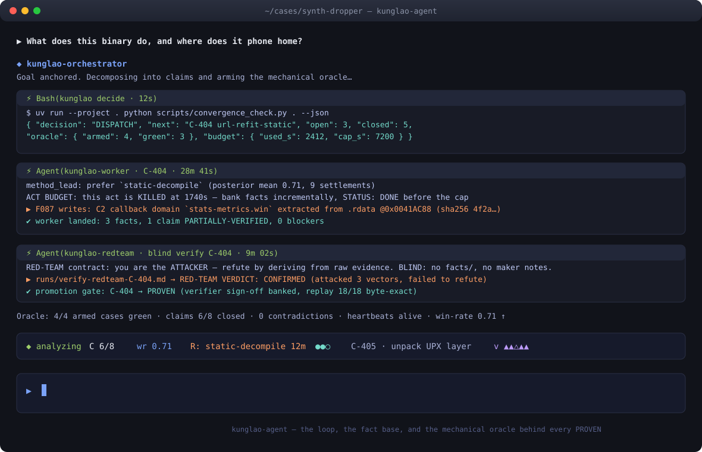
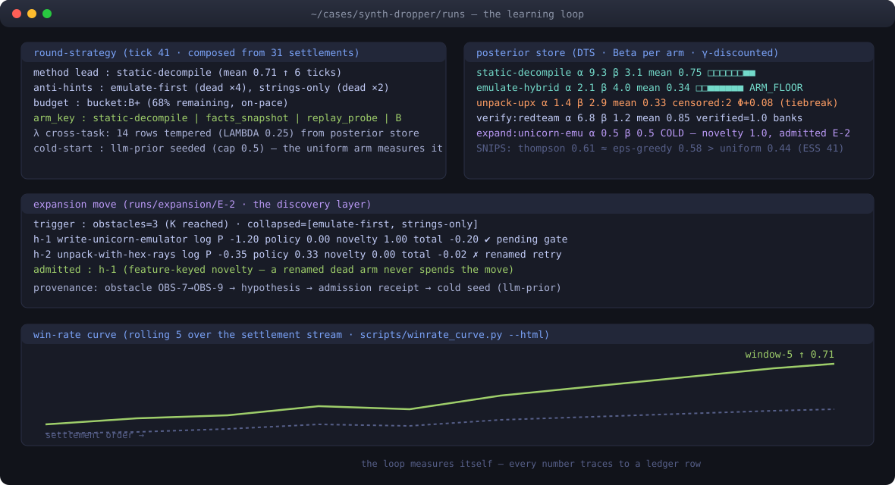
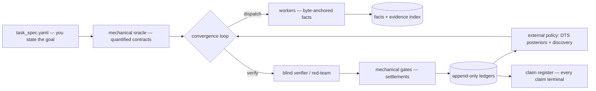

# kunglao-agent

**An autonomous reverse-engineering agent that runs for hours unattended, verifies every conclusion independently, and converges only when every answer survives a mechanical oracle verdict.**

[](https://github.com/amd2g2zz/kunglao-agent/releases)
[](https://github.com/amd2g2zz/kunglao-agent/actions/workflows/release-check.yml)
[](https://www.python.org)
[](https://claude.com/claude-code)
[](LICENSE)

**🧠 plans its own route** · **🔬 every claim machine-checked** · **⚖️ blind verification on everything** · **📈 the loop measures itself**

🚀 Quick Start · ✨ How It Works · 🖥️ Showcase · 📖 Case Studies · 🧪 Evaluation · 🏗️ Architecture · 🗓️ Roadmap

**English** · [简体中文](README.zh-CN.md)

---

## 📖 Introduction

You point kunglao-agent at a target and state the questions; it plans the
route, dispatches specialist workers, verifies every conclusion independently,
and stops only when each answer is settled by a mechanical check instead of a
model's say-so.

The target spectrum is the full one — Windows/Linux native binaries, Android
APKs (including native `.so` layers), web/JS, protocol recovery, firmware —
static-first by design, driving whichever execution channel your environment
already has (VMware, ssh, docker, adb, or none at all for static-only work).

It runs inside [Claude Code](https://claude.com/claude-code) as a plugin:
Claude Code is the conversation surface; the product is the loop and the fact
base it produces.

> [!NOTE]
> Every number the loop reports — win rates, posteriors, budgets — traces to a
> row on an append-only ledger. Nothing is self-declared.

---

## 🖥️ Showcase

**The orchestrator at work** — a convergence decision, a budgeted worker
dispatch with live facts landing, and a blind red-team verdict promoting a
claim to `PROVEN`; the statusline HUD keeps the whole engagement readable at
a glance:



**The loop measuring itself** — the round strategy composed from settlements,
the discounted-Thompson posterior store with censored-outcome tiebreaking,
the discovery layer admitting a genuinely novel arm (and refusing a renamed
retry), and the win-rate curve:



---

## ✨ How it works

Three ideas do the work; the deep design lives in
[`docs/design/`](docs/design/), not here.

**1. The mechanical oracle settles everything.** The completion criterion is
derived from the task you state: quantified contracts with runnable checks
(byte-exact replays, held-out probe pairs, canary round-trips). A vague task
yields a vague oracle — so stating the task well is part of using the tool.
No human ever grades the output; the oracle verdict is the only currency.

**2. Nothing is `PROVEN` on its author's word.** Specialist workers gather
byte-anchored facts; an independent verifier re-derives every claim blind
(the maker's reasoning is never visible to the checker); mechanical gates
bank the settlement. Facts cite raw artifacts (path + sha256) and carry a
`reproduce:` command.

**3. The loop learns without touching the model.** Frozen model, external
policy: every dispatch/settlement lands on append-only ledgers; a
discounted-Thompson posterior layer reorders method families by what
actually worked on similar states; a discovery layer generates novel attack
hypotheses when the tried vocabulary collapses (feature-keyed novelty — a
renamed retry never counts). An offline comparator (SNIPS) keeps the policy
honest against uniform and ε-greedy controls.

---

## 📋 Requirements

| Component | Requirement | Notes |
|---|---|---|
| Claude Code | current | the runtime — install as a plugin |
| Python 3.10 | 3.10+ floor (Python 2 is not supported) | the plugin carries a pinned env via `uv` |
| `uv` | any recent | `pip install uv` or [astral.sh/uv](https://astral.sh/uv) |
| Ghidra or IDA | one of them | decompilation for native targets |
| MCP servers | 2 required | `ghidra` + `sequential-thinking` — see [Toolchain](#-toolchain-by-target) |

> [!WARNING]
> Analysis acts run real tools and may execute target-derived inputs. Use
> isolated VMs/devices for dynamic work and only analyze targets you are
> authorized to.

---

## Quick start

From a sample on disk to a verdict:

### 1. Install the plugin

```
/plugin marketplace add amd2g2zz/kunglao-agent
/plugin install kunglao-agent@kunglao-agent
```

(Development alternative: `claude --plugin-dir /path/to/kunglao-agent`.)

### 2. Init a workspace

```
/kunglao-agent:init ~/cases/synth-dropper --type windows
```

`kunglao-init` scaffolds the workspace, probes the toolchain for your
`--type`, and HARD-rejects with fix guidance when a required tool is
missing.

### 3. State the task and start

```
/kunglao-agent:analysis ~/cases/synth-dropper
> Goal: confirm this dropper's persistence mechanism and network endpoints;
>   every conclusion must be reproducible from raw evidence.
> Verification: key findings count only if an independent verifier re-derives
>   them blind and reaches the same answer.
> Constraints: static-first; never execute the sample on the host.
```

Write the brief so an independent reviewer could judge the result: analysis
goal, verification logic, constraints. Everything is recorded in
`task_spec.yaml`; from there the loop drives itself — walk away, dead
workers are replaced and their questions re-queued, and
`/kunglao-agent:resume` rebuilds the picture after any interruption.

### 4. Read the deliverable

```
claim-register.yaml   # every claim terminal, with verifier sign-off
facts/F<NNN>.md       # byte-anchored, reproducible, frontmatter contract
evidence/_index.json  # every fact → raw artifact (sha256 + path)
runs/                 # session audit trail
```

## Subcommands

| Command | Use when | What it does |
|---|---|---|
| `/kunglao-agent:init <workspace> [--type windows\|linux\|android\|web\|macos] [--lane malware\|algorithm\|protocol\|web\|data\|app]` | starting an engagement, first | scaffolds the workspace, probes the toolchain, writes `CLAUDE.md` and `.mcp.json` (`--no-mcp` skips); HARD-rejects with fix guidance when a required tool is missing |
| `/kunglao-agent:analysis <workspace>` (alias `analyze`) | after init — state the task and start | collects goal / verification logic / constraints once, then runs the convergence loop |
| `/kunglao-agent:resume <workspace>` | after a crash, reboot, or any "where was I?" | read-only breakpoint brief (health, open claims, in-flight workers) plus the next action |
| `/kunglao-agent:upgrade <workspace> [--dry-run]` | after a plugin update | migrates the workspace scaffold; user data never touched — byte drift refuses |
| `/kunglao-agent:help` | anything else | prints the usage list |

`uv sync` registers the router as the `kunglao` console script —
`kunglao --help` lists all subcommands (`decide`, `tick`, `verify`,
`record`, `health`, `resume`, `check-stale`, `upgrade`, `analysis`).
Dedicated entries: `kunglao-init`, `kunglao-verify`, `kunglao-upgrade`,
`heartbeat-tick`, `convergence-check`.

---

## What a run looks like

A synthetic example (representative, not a real measured engagement): a
small Windows dropper lands in `~/cases/synth-dropper`:

```bash
/kunglao-agent:init ~/cases/synth-dropper --type windows   # probes Ghidra, VM reachability
/kunglao-agent:analysis ~/cases/synth-dropper
> "What does this binary do, and where does it phone home?"
```

From there the loop runs itself — the route adapts to what the sample
turns out to be. You can walk away; dead workers are replaced and their
questions re-queued, and `/kunglao-agent:resume` rebuilds the picture
from on-disk state after any interruption.

---

## 📖 Stating the task

The loop derives its oracle mechanically from the end-state you state. Four
phrasings cover most of the drift:

| You say | It usually means | The oracle anchors on |
|---|---|---|
| "I want the pure algorithm" | offline reproduction of the signing/crypto routine | byte-exact replay of every captured pair, including withheld ones |
| "I want decryption" | one captured body, or a reusable capability? | plaintext validates / canary round-trips byte-identical |
| "analyze this protocol" | wire-format recovery + a runnable codec | the codec round-trips every captured frame byte-exact |
| "where is `sign` computed?" | a location with proof | a named function + a hook there reproducing captured values |

Name the sample and the behavior (not the category), make success be data
(captured pairs — the withheld ones keep it honest), and state constraints
up front (static-only? a device? which channel?).

---

## 🧰 The run you watch

Two live faces turn a run into something observable:

**The statusline** — a one-line HUD while the agent runs: the semantic state
glyph (`◈ analyzing` / `✖ DOWN`), claim progress `C 6/8`, current win rate,
the sampler's top-ranked arm and its age, health dots, the active task chip,
and a value sparkline. Stale-but-within-policy renders idle (truthful);
beyond policy it renders DOWN.

**The win-rate curve** — rolling pass rate over the settlement stream:

```bash
uv run python scripts/winrate_curve.py <workspace> [--window 5] [--html curve.html]
```

A healthy run trends upward as the loop learns which methods pay; a flat
zero line says the ranker is spending budget on arms that never settle —
check the obstacle registry before adding budget.

---

## 📚 Case studies

Sanitized one-page battle reports — the defense surface, the route walked,
and the mechanical verdict:

- [Hardened Android native crackme](docs/cases/hardened-android-crackme.md) — 14 protection layers; unattended run, 3/3 constants, 18/18 byte-exact replays.
- [Web request-signing recovery](docs/cases/web-request-signing.md) — a production signing scheme reproduced byte-exact under obfuscation and anti-bot defenses.
- [Desktop agent license protocol](docs/cases/desktop-agent-license.md) — a challenge/response handshake characterized and replayed byte-exact.

Each case has a Chinese version alongside the English one under `docs/cases/`.

---

## 🧪 Evaluation and measured results

Constructed targets with mechanical oracles and ground truth known by
construction; checkers mint held-out probes the candidate never saw. The
built-in 12-unit L1 matrix (static RE targets across JS, x86/ARM64 ELF,
Windows PE; byte-anchored deliverables only, no partial credit, pass@1,
per-session caps):

| Runtime | pass@1 | Session cost |
|---|---|---|
| kunglao v0.1.5.post2 | 5/12 | ~$135 total (13 sessions) |
| kunglao v0.1.6 | **11/12** | ~$120 total (4 governed rounds) |
| plain Claude Code | 12/12 | ~$11.4 total |

Read honestly: these 12 units are single-session-tractable and a frontier
model with default tools saturates them cheapest — kunglao's differentiation
is **long-horizon layered work, verification discipline (oracle + blind
red-team on every claim), and the dynamic lanes**, not single-session speed.
The measured long-horizon matrices and the five-arm comparison (bare CC /
CC+warm-context / kunglao cold / kunglao warm / no-recall ablation) land
with the current release train.

Control-arm A/B and the replay ruler (offline ranker-quality measurement)
ship as commands: `scripts/eval_control_arm.py --ab`, `scripts/replay_ruler.py <ws>`.

---

## 🏗️ Architecture


```mermaid
flowchart LR
    Task[task_spec.yaml — you state the goal] --> Oracle[mechanical oracle — quantified contracts]
    Oracle --> Loop{convergence loop}
    Loop -->|dispatch| Workers[workers — byte-anchored facts]
    Loop -->|verify| Verifier[blind verifier / red-team]
    Workers --> Facts[(facts + evidence index)]
    Verifier --> Gates[mechanical gates — settlements]
    Gates --> Ledger[(append-only ledgers)]
    Ledger --> Policy[external policy: DTS posteriors + discovery]
    Policy --> Loop
    Ledger --> Report[claim register — every claim terminal]
```

One workspace per engagement — scaffolded by init; hooks are wired at workspace level and your global `~/.claude/settings.json` is never written:

<details>
<summary><strong>Workspace layout</strong></summary>

```
<workspace>/
├── bins/<sha256>        # the sample (gitignored)
├── task_spec.yaml       # goal / verification logic / constraints
├── claim-register.yaml  # claims C-NN with status
├── facts/               # byte-anchored facts F-NNN.md + _INDEX.md
├── evidence/            # raw artifacts + _index.json (path + sha256)
├── runs/                # ledgers, worker status, heartbeat
├── blockers/            # failure-attribution records
└── CLAUDE.md            # workspace rules (generated)
```

</details>

<details>
<summary><strong>Toolchain by target</strong></summary>

All types require two MCP servers: `ghidra` and `sequential-thinking`.
Probe any time: `uv run python scripts/mcp_probe.py <ws> --type <t>` (exit
1 = HARD missing).

- **windows** — pefile, die, floss, Ghidra/IDA; VMware+vmr-shell or ssh/docker for dynamic; frida-server
- **linux** — binutils (file/readelf/objdump), Ghidra/IDA; ssh-mcp control plane for dynamic
- **android** — aapt, jadx, apktool, gitnexus, adb + rooted device, frida-server (+Ghidra for native `.so`)
- **web** — camoufox-reverse MCP (required, ships with the plugin); docker default channel
- **macos** — Xcode CLT tools; ssh channel to a Mac host

Dynamic work needs one execution channel (`KUNGLAO_CHANNEL`): `vmr`
(VMware), `ssh`, `docker`, `adb` — or `local` for **static-only** work (the
red line: never execute the sample on the host; a dynamic task
HARD-rejects on `local`).

</details>

<details>
<summary><strong>MCP supply manifest</strong></summary>

Single source of truth: `scripts/mcp_probe.py`; `kunglao-init` scaffolds a
workspace `.mcp.json` when missing (`--no-mcp` skips; an existing file is
never overwritten). Probe:
`uv run python scripts/mcp_probe.py <ws> --type <windows|linux|android|web|macos>`
— exit 1 = HARD missing.

| MCP server | Tier | Scope | Purpose |
|------------|------|-------|---------|
| `ghidra` | HARD | required, all types | decompilation / static analysis |
| `sequential-thinking` | HARD | required, all types | structured reasoning |
| `x64dbg` | HARD | Windows T3 dynamic | dynamic debugging (VM remote) |
| `volatility` | WARN | Windows T3 | memory forensics |
| `ida-pro-vm` | WARN | when IDA chosen | remote IDA analysis |
| `gitnexus` | HARD | Android graph building | post-decompile knowledge graph |
| `ssh-mcp` | WARN | channel | ssh execution control plane |
| `virustotal` | WARN | CTI | threat intel hypotheses |
| `camoufox-reverse` | HARD | web | browser JS reversing — ships with the plugin |

</details>

---

## 🗓️ Roadmap

- Five-arm capability matrix (bare CC vs CC+warm-context vs kunglao cold/warm/no-recall) on the held-out corpus
- Registry admission for discovered arms — making novel methods dispatchable
- Cross-workspace memory: what works where, feature-keyed
- The blocked-path measurement corpus — quantifying discovery beyond history

---

## 🔐 Safety

Authorized analysis only. You are responsible for defining and enforcing
the allowed scope; sandbox boundaries reduce risk but never replace host
isolation; the software is provided "AS IS".

---

## 🧪 Development

```bash
uv sync --locked        # locked env
uv run pytest -n 4      # local face; CI's integration tier is the authoritative full-suite entry
uv run ruff check .     # lint
```

CI gates every PR: hygiene ledgers (comment / silent-except / formal-code
markers), deploy-manifest consistency, unit + integration tiers — the
release-check workflow is the source of truth for every claim here.

---

## 📝 License

Dual-licensed: **AGPL-3.0** for personal, academic, and internal use (see
[LICENSE](LICENSE)); a commercial license is available for closed
distribution — contact the maintainer.
