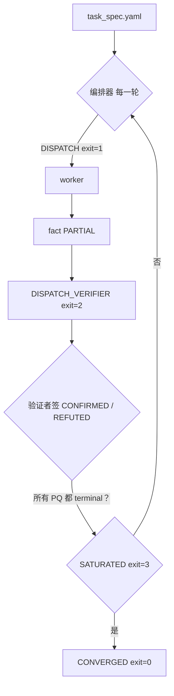

# kunglao-agent

**一个跑“收敛驱动”逆向循环的 Claude Code 技能 —— 自己规划路径，从原始证据推导每一条事实，在机械化校验门控下收敛。**

[](https://github.com/amd2g2zz/kunglao-agent/actions/workflows/release-check.yml) [](.) [](.) [](.) [English](README.md) · [简体中文](README.zh-CN.md)

把目标样本丢进工作区，告诉它你想知道什么，技能就开跑：专家 worker 先做静态分析，独立验证者从原始证据盲重推每一条事实，机械门控决定什么时候算分析完成。交付物是一个事实库：每条声明都有字节锚定、独立验证、证据索引 —— 信任靠机器执行，不靠口头约定。

---

## 目录

- [这是什么](#这是什么)
- [快速开始](#快速开始)
- [一个真实分析流程的样子](#一个真实分析流程的样子)
- [场景演练](#场景演练)
- [你得到什么](#你得到什么)
- [循环怎么跑](#循环怎么跑)
- [分析原则](#分析原则)
- [按目标类型分工具链](#按目标类型分工具链)
- [配置](#配置)
- [自带分析环境](#自带分析环境)
- [内部](#内部)
- [实战效果](#实战效果)
- [开发](#开发)
- [局限](#局限)
- [安全](#安全)
- [许可证](#许可证)

> **术语约定**：本文保留这些已建立术语的英文原文，不翻译 —— `kunglao-agent`、`PROVEN`、`RED-CHECKER`（独立验证者）、`MCP`、`fact`、`claim`、`task_spec.yaml`、`claim-register.yaml`、`evidence/_index.json` 等。其余文字均为中文。

---

## 这是什么

kunglao-agent 是一个 Claude Code 技能，能像逆向工程专家一样在完整的任务光谱上工作 —— 固件仿真、风控对抗、Web/JS 逆向、协议分析、原生二进制 triage，不是单一领域工具。仓库里的 Python 模块是技能的“内脏”，由 hooks、agent、CI 调用。唯一面向用户的界面就是 Claude Code：你和它对话，读它的报告。

### 前置条件（任何 type 都必须装）

| 工具 | 作用 | 安装 |
|---|---|---|
| **Claude Code** | 唯一用户界面 | 装 Anthropic 官方版 |
| **Python 3.10+** | 插件自带 `uv` 管理的锁定环境，你不用动 | 系统装或 `uv` 管 |
| **`uv`** | 锁定环境解析器 | `pip install uv` 或 [astral.sh/uv](https://astral.sh/uv) |
| **Ghidra 或 IDA** | 二选一，作为反编译器 | 见 [内部](#内部) |

其他工具按目标 type 区分 —— 见 [按目标类型分工具链](#按目标类型分工具链)。

---

## 快速开始

从磁盘上的样本到 verdict 的最短路径。

### 1. 装插件

在任意目录下，进入 Claude Code：

```
/plugin marketplace add amd2g2zz/kunglao-agent
/plugin install kunglao-agent@kunglao-agent
```

（也可以：开发模式 `claude --plugin-dir /path/to/kunglao-agent`；遗留路径 `git clone ~/.claude/skills/kunglao-agent`。）

### 2. 初始化工作区

```
/kunglao-agent:init ~/cases/synth-dropper --type windows
```

`kunglao-init` 搭好工作区、写好 `CLAUDE.md`、对你选的 `--type` 做工具链探测、生成 `.mcp.json`。**任何 HARD 工具缺失时 init 会 HARD-reject**，修复指引会写在错误块里。

### 3. 提出任务

```
/kunglao-agent
```

编排器读 `task_spec.yaml`（一次性 intake：主问题、范围、约束、成功标准）并进入收敛循环。第一个 tick 派静态 worker；下一个 tick 派独立的 BLIND 验证者去验证半成品 fact；循环在 `dispatch` / `dispatch_verifier` / `saturated` / `blocked` 之间切换，直到每个主问题都达到 PROVEN，退出码 0。

### 4. 看交付物

```
claim-register.yaml   # 每条 claim 都到 terminal，含验证者签核
facts/F<NNN>.md       # 字节锚定、可复现、frontmatter 契约
evidence/_index.json  # 每个 fact 对应一份原始证据（sha256 + 路径）
runs/                 # 会话审计轨迹
```

---

## 一个真实分析流程的样子

*下面是一段代表性、合成的、跑在小样本上的 session 演示。它展示一次分析的“形状”，不是测量结果 —— 真实战绩见 [实战效果](#实战效果)。*

**设置。** 一个小型 Windows dropper 落到 `~/cases/synth-dropper`。操作员初始化工作区：

```
/kunglao-agent:init ~/cases/synth-dropper --type windows
```

`kunglao-init` 搭好工作区、写好 `CLAUDE.md`、探测工具链（Ghidra 在线、VM 可达）、生成 `.mcp.json`。操作员跑 `/kunglao-agent` 并提任务：“这个二进制干了什么，回连到哪里？”

**循环。** 编排器打开 `task_spec.yaml`，主问题是（capability / persistence / network）。每一 tick 是一次机械决策：

1. `DISPATCH` —— 先派一个静态 worker，带明确合约（`[T1 tools=pe_analyze,strings-classify] claim C-001`）。它写事实：PE 结构、按能力类别归类的 imports、内嵌字符串、overlay 扫描。
2. `DISPATCH_VERIFIER` —— 对每条事实，redteam 验证者从原始证据盲重推答案（绝不读 maker 的结论），签 `CONFIRMED`；事实进入 `PROVEN`。
3. `SATURATED` / `BLOCKED` tick 轮询卡住的 worker 或处理 blocker —— 循环不会因为还有 open claim 就空转。
4. `CONVERGED` —— 每个主问题都有字节级证据，零孤立 claim。循环退出 0 并生成报告。

**交付物。** `claim-register.yaml`（每条 claim 都 terminal）、`facts/`（每条事实字节锚定、带出处和复现命令）、`evidence/_index.json`（每条事实可追到原始证据）、最终报告。每次 tick 在 `runs/` 里都有一条 ledger 行 —— 整段会话的审计轨迹。

---

## 场景演练

三条端到端的实操路径。挑一条匹配你的目标。

<details>
<summary><strong>Android APK —— 用户敲什么、产物落到哪</strong></summary>

```bash
# In Claude Code:
/kunglao-agent:init ~/cases/doubao.apk --type android
/kunglao-agent
> state the task: "capability / persistence / network entry points"
```

编排器走标准 Android 流程：

```
APK → aapt/apktool 解包 → jadx（DEX → Java）
  → gitnexus analyze（构建反编译后的知识图谱）
  → 静态分析（基于图谱的 class / call-chain / 入口点定位）
  → 只有静态卡住时才进入动态链：
       ADB → root → debug flag → 改名 frida-server（自定义端口）或 android_server
  → 最后兜底：frida hook + unidbg 混合
```

- **产物落在哪：** `bins/<sha256>`（APK 本身）、`facts/F001..`（jvm class 图谱）、`facts/F050..`（native .so 清单，如果有）、`evidence/`（capture 日志、dump）。`claim-register.yaml` 里 claim 都收敛到 PROVEN。
- **“完成”长什么样：** `convergence_check.py` 返回 0；每个主问题至少有 1 条 PROVEN 事实；`task-oracle.yaml` 处于 FAILED-closed。

</details>

<details>
<summary><strong>Web / JS —— 解包 → 去混淆 → 带签参数重放</strong></summary>

```bash
# In Claude Code:
/kunglao-agent:init ~/cases/wonderflow.com --type web
/kunglao-agent
> state the task: "XHR 签名是怎么算的，nonce 从哪来？"
```

编排器走 web-re 流程：

```
site → camoufox-reverse（反检测 Firefox：hooks / trace / 网络抓包）
  → 解包（wakaru / webcrack 分流）
  → 去混淆（还原编码层 / 解析 opaque predicate）
  → 索引（命名函数骨架 / 暴露的接口）
  → 带签参数追踪（五步重放循环）
  → verify-by-replay：只从输入重推签名
```

- **产物落在哪：** `evidence/<capture>.har`、`evidence/<bundle>.js`（已去混淆）、`facts/F001..`（签名密钥）、`facts/F050..`（nonce 推导）。验证者从输入 + 密钥盲重推签名，验证模型正确。
- **注意：** web 是 *labs* 目标 —— 按设计就没有 HARD 项。`camoufox-reverse` MCP 是 WARN；docker channel 在场是 WARN。init 不会卡，但循环在实际需要时会把缺失的能力浮出来。

</details>

<details>
<summary><strong>本地二进制（Windows PE / Linux ELF）—— DIE → ghidra-light → claim</strong></summary>

```bash
# In Claude Code:
/kunglao-agent:init ~/cases/synth-dropper --type windows
/kunglao-agent
> state the task: "capability / persistence / network"
```

编排器走桌面 RE 流程：

```
样本 → pefile / die / floss（T0：能力 / 字符串 / 加壳家族）
  → ghidra-light：analyzeHeadless 后期脚本
       (recon / decompile-functions / vtable-struct / scan-pointer / evidence-annotations)
  → 在反编译树上做静态分析
  → 通过 vmr-shell / ssh / docker / adb channel 走动态链
  → claim register 一路推进到 PROVEN
```

- **产物落在哪：** `evidence/die.json`（语言 / 加壳家族）、`evidence/floss-filtered.json`（已解码字符串，每类 top-K）、`evidence/static-ghidra.json`（函数 / imports / xrefs）、`facts/F001..`（按能力类别归类的 imports）、`facts/F050..`（已解码字符串 + 索引）。
- **何时升级 T2/T3：** 当静态关不掉主问题时（比如 opaque 常量、反 disasm、加壳 payload）。派工合约里必须列出静态解决不了的 gap。

</details>

---

## 你得到什么

声明登记 + 事实库，信任靠机器执行，不是口头约定：

- **验证式收敛** —— `PROVEN` 要求独立 BLIND 验证者逐字节重推确认；`CONVERGED` 要求每个主问题都有字节级证据、零孤立 claim、不空转。
- **证据完整性** —— 每条事实都能通过 `evidence/_index.json` 追到原始证据（capture / trace / dump / 二进制）。按设计排除派生摘要。
- **Maker-checker** —— worker（maker）写事实，redteam 验证者（checker）从原始证据盲重推。永远是不同的 agent。

### 事实样例

```yaml
id: F061
status: VERIFIED-BY-W01-static-byte-recheck
confidence: almost_certain        # ICD-203 7-tier
claim_id: C-401
provenance:
  - {role: sample, path: bins/<sha>}
  - {role: capture_log, path: runs/c329-inner-pe.bin}   # cited via evidence/_index.json
reproduce: |
  python -c "import struct; d=open('runs/c329-inner-pe.bin','rb').read(); ..."
verifier_sign_off:
  verifier: kunglao-redteam
  verdict: CONFIRMED
  derived_via: [struct.parse, pefile, capstone]
```

---

## 循环怎么跑

每个 tick 是一次机械决策：

| Decision | Exit | 做什么 |
|---|---|---|
| `DISPATCH` | 1 | 按 VoI/成本排序 open claim，派顶端的专家 worker |
| `DISPATCH_VERIFIER` | 2 | 派一个 BLIND 验证者去验证半成品 fact |
| `SATURATED` | 3 | 轮询卡住的 worker —— 有空槽 + open claim 时绝不允许空转 |
| `BLOCKED` | 4 | 解决 blocker（自愈 L1→L2→L3），重新检查 |
| `CONVERGED` | 0 | 每个主问题都有字节级证据；生成报告 |

派工合约必须显式 —— `[T1 tools=grep,xxd] claim C-007 <task>`，由 `worker_budget` hook 强制执行：≤3 个并发 worker、每个 claim 有上限、tier 门（T1 静态 / T2 仿真 / T3 VM）、实时心跳、plan-with-content、T2/T3 工单必带“静态 gap 清单”。

### 收敛流程



---

## 分析原则

五层，按优先级 —— 静态优先，只有当上一层确实不够时才升下一层：

1. **静态闭环** —— 优先用静态方法把分析做完；能用静态做完的任务绝不碰动态工具。
2. **用仿真去混淆** —— 仿真执行剥掉混淆层（opaque predicate、间接跳转、计算常量、编码块），结果回到静态分析里。仿真是静态的辅助，不是替代。
3. **debug 补声明的 gap** —— 动态调试（x64dbg / gdbserver / frida）是补充，不是默认：每个 T2/T3 派工必须声明要解决什么静态 gap。
4. **仿真兜底** —— 静态 + debug 都做完但逻辑仍解不开时（比如黑盒加密），用 frida-hook + unidbg 仿真混合方案；三条件都满足才用：frida 数据已采集、ida/ghidra 反编译已完成、还是卡住。
5. **搭环境** —— 最坏情况：搭/改一个环境（匹配 OS版本、重签名 APK、沙箱、JNI 环境），让样本能完整运行、全程可观测。

---

## 按目标类型分工具链

`kunglao-init --type` 一旦选定，就锁死了哪些 HARD 工具必须装。安装指引默认折叠 —— 展开你目标对应的 section 即可。

<details>
<summary><strong>windows（PE32+ x86-64）</strong> —— Windows 原生二进制</summary>

| Tier | 工具 | 安装 |
|---|---|---|
| HARD | `pefile`（Python） | `pip install pefile` |
| HARD | `die`（Detect It Easy） | `KUNGLAO_DIE` 环境变量或在 PATH —— [ntinfo.com](https://ntinfo.com) |
| HARD | `floss`（FLARE FLOSS） | 按 [flare-floss 文档](https://github.com/mandiant/flare-floss) 装 |
| HARD | Ghidra 或 IDA | 二选一；见 [内部](#内部) |
| HARD（T2/T3） | VMware + vmr-shell | 动态需要 —— 见 [自带分析环境](#自带分析环境) |
| HARD（T2/T3） | `frida-server`（改名，自定义端口） | 设备端二进制，默认端口 1337 |
| HARD（T2/T3） | `x64dbg-automate-mcp` | x64dbg 远程控制 MCP |
| WARN | `volatility` MCP | 内存取证 —— 可选 |
| WARN | IDA-Pro MCP | 只在 IDA 选用时 |

动态捷径：如果你已经有 Windows VM，`ssh` / `docker` channel 可以代替 `vmr`；`local` **按设计只能做静态**（不在主机跑样本）。

</details>

<details>
<summary><strong>linux（ELF）</strong> —— Linux 原生二进制 / 固件 / 内存镜像</summary>

| Tier | 工具 | 安装 |
|---|---|---|
| HARD | `file`、`readelf`、`objdump` | `binutils` 包 |
| HARD | Ghidra 或 IDA | 二选一 |
| HARD（T2/T3） | VMware + vmr-shell，或 ssh / docker 控制平面 | 见 [自带分析环境](#自带分析环境) |
| HARD（T2/T3） | `frida-server`（改名，自定义端口） | 设备端，端口 1337 |
| WARN | `gdbserver` | 主机侧 PATH 查找（VM 端二进制由 VM channel 验证） |
| WARN | `strace`、`ltrace` | 可选 |
| WARN | eBPF（目标 VM 内核 ≥ 6.0） | 仅信息 |

`ssh-mcp` MCP 给远程 / 云 / docker 主机开 ssh 控制平面。

</details>

<details>
<summary><strong>android（APK / DEX / native .so）</strong> —— 难度最高、HARD 项最多的 type</summary>

| Tier | 工具 | 安装 |
|---|---|---|
| HARD | `aapt` 或 `aapt2`（或 `unzip` 兜底） | Android SDK build-tools |
| HARD | `jadx`（DEX → Java 反编译器） | [skylot/jadx](https://github.com/skylot/jadx) |
| HARD | `apktool`（APK 资源解码 / 重打包） | [iBotPeaches/Apktool](https://github.com/iBotPeaches/Apktool) |
| HARD | `gitnexus`（反编译后图谱） | `npm i -g gitnexus` |
| HARD | Ghidra 或 IDA | 仅当 APK 含 native `.so` 时 |
| HARD | `adb` + **已 root 设备**，`ro.debuggable=1` | platform-tools + 设备端自定义 frida |
| HARD | `frida-server`（改名，自定义端口 1337） | 设备端二进制 |
| HARD | `android_server`（IDA 远程调试） | 设备端二进制，端口 23946 |
| WARN | `apkid` | `pip install apkid` |
| WARN | `baksmali` | 从 [smali releases](https://github.com/baksmali/smali/releases) 下载 |

Android 的 MCP 要求（全是 HARD）：`ghidra`、`sequential-thinking`（所有 type 都必需）、`gitnexus`（Android 图谱必需）。用 `python scripts/mcp_probe.py <ws> --type android` 验证 —— 退出 1 表示 HARD 缺失，init 拒绝。

</details>

<details>
<summary><strong>web（labs）</strong> —— 最小工具链，按设计没有 HARD</summary>

| Tier | 工具 | 安装 |
|---|---|---|
| WARN | `camoufox-reverse` MCP | 反检测 Firefox（hook / trace / 网络抓包） |
| WARN | `docker`（web channel 默认） | Docker Desktop，或显式 `KUNGLAO_CHANNEL=ssh` |

Web 按设计就是 **零 HARD 项** —— labs 永不 FAIL-HARD。能力缺失时由循环在实际需要时浮出来，而不是 init 卡住。如果你打算用可选的 x64dbg 路径做浏览器侧调试，按 Windows 工具链装就行。

</details>

<details>
<summary><strong>macos（labs）</strong> —— 仅 WARN，按设计没有 HARD</summary>

| Tier | 工具 | 安装 |
|---|---|---|
| WARN | `lipo`、`otool`、`nm`、`codesign`、`xattr` | Xcode Command Line Tools |
| WARN | `ghidra` MCP | 推荐 —— [bridge-mcp-ghidra](https://github.com/NationalSecurityAgency/ghidra) |

macOS 是 labs 目标 —— 没有 HARD 项。动态用 `ssh` channel（连到 Mac 主机）；`local` 只能做静态。

</details>

### 任何 type 都必需

| Tier | 工具 | 安装 |
|---|---|---|
| HARD | `ghidra` MCP | `claude mcp add ghidra -- <path>/bridge-mcp-ghidra.exe` |
| HARD | `sequential-thinking` MCP | `claude mcp add sequential-thinking -- npx -y @modelcontextprotocol/server-sequential-thinking` |

统一真源： `python scripts/mcp_probe.py <ws> --type <windows|linux|android|web|macos>`。

---

## 配置

| 变量 | 默认 | 含义 |
|---|---|---|
| `CLAUDE_CODE_EXPERIMENTAL_AGENT_TEAMS` | `0` | 必须保持 `0`/未设 —— 真值会让派工走 teammate channel（`env_check_gate` 拒绝） |
| `KUNGLAO_VM_HOST` | 未设 | 动态分析的 VM 租用主机（vmr-shell :9876 / Frida :1337） |
| `KUNGLAO_CHANNEL` | `vmr` | 动态分析执行控制平面：`vmr` \| `ssh` \| `docker` \| `adb` \| `local`（见 [自带分析环境](#自带分析环境)） |
| `KUNGLAO_DOCKER_CONTAINER` | 未设 | `ssh`/`docker` channel 的可选 docker 执行目标（探测跑一次 `docker exec <c> true`） |
| `GHIDRA_HOME` | 未设 | Ghidra 安装根目录（要含 `support/analyzeHeadless.bat`） |
| `KUNGLAO_FRIDA_PORT` | `1337` | 覆盖默认的自定义 frida-server 端口 |
| `KUNGLAO_DIE` | 未设 | DIE 可执行路径（兜底是 PATH） |
| `KUNGLAO_CLAUDE_JSON` | 未设 | 覆盖用户级 `~/.claude.json` MCP 注册表（测试用） |

---

## 自带分析环境

动态调试需要**一个 agent 能驱动的执行控制平面**。`KUNGLAO_CHANNEL` 选五个一等公民 channel 之一 —— 哪个你环境已有就用哪个，没有降级模式：

| Channel | 驱动什么 | 前置 |
|---|---|---|
| `vmr`（默认） | VMware 驱动的 VM，**任何客户机系统**。snapshot/revert 工作流是不可替代的价值 —— Linux VM 可用 `vmr`（snapshot）或 `ssh`（更轻），你选 | vmr-shell 技能；`KUNGLAO_VM_HOST` + 端口 9876/1337 |
| `ssh` | 任何 ssh 可达的机器：远程裸机、云 VM、Mac、iOS 主机、远程 docker 主机 | `KUNGLAO_VM_HOST` + 密钥认证（探测跑 `ssh -o BatchMode=yes -p $KUNGLAO_VM_SHELL_PORT <host> true`；BatchMode） |
| `docker` | 本机或远程 docker daemon —— `docker exec` 等价于任何控制路径 | `docker version` 绿（远程用 `DOCKER_HOST`）；可选 `KUNGLAO_DOCKER_CONTAINER` 作为执行目标 |
| `adb` | 安卓模拟器或真机 | `adb devices` 显示设备；`adb forward tcp:1337 tcp:1337` 给 frida |
| `local` | **仅主机侧静态分析。** 当静态工具能回答主问题或没有动态基础设施时，这是正确选择 | 无 —— 见下面的红线 |

> **`local` 红线：** local 是为**静态**工作准备的一等公民 channel —— 绝不在主机上执行、调试、注入样本。任何动态需求必须把 `KUNGLAO_CHANNEL` 切到 `vmr`/`ssh`/`docker`/`adb`；init 对动态任务 + `local` 组合会 HARD-reject。

channel 探测只对动态任务跑（仅静态任务跳过全部探测，报告 WARN 提示）。`ssh` channel 上的执行流过 **ssh-mcp** 控制平面（`npm i -g ssh-mcp`，TOML 配置 —— 工具 `run-command`、`sftp-upload`、`sftp-download`、session suite）；裸 CLI ssh 是兜底。远程 docker 走 ssh 时，设 `KUNGLAO_DOCKER_CONTAINER`，ssh 探测还会额外验证 `docker exec` 走通。

---

## 内部

<details>
<summary><strong>工具货架（worker 复用索引）</strong></summary>

工具货架：可复用的分析逻辑被吸收为**注册过的工具**（机器契约 `tools/_INDEX.yaml`，由 `tools/validate_index.py` 校验；人类索引 `tools/_index-<category>.md`）。Worker 写新脚本前必须查索引（`toolfirst` 门控）；`tools/tool-search.py` 按能力标签和成本预算查询。

| Category | Tools |
|---|---|
| `crypto` | `crypto-tool` —— 8 个算法，仅用标准库：`chacha`（RFC + 非 RFC）、`xor-add`、`rolling-xor`、`lzss`、`lzma-raw`、`rsa-unpad`、`go-byte-transform`、`va-to-off`；全部支持 `--reproduce` |
| `ghidra` | 5 个 analyzeHeadless 后期脚本：recon / decompile-functions / vtable-struct / evidence-annotations / scan-pointer |
| `static` | disasm-constant-check + syscall / stack-strings / overlay / PE / shellcode 扫描 CLI |
| `pipelines` | `build-evidence-index` —— 证据索引构建器（evidence/_index.json + _INDEX.md） |
| `aux` | legacy-PROVEN 审计 / golden capture / blind-coverage / cold-start metrics |

主机侧仿真（T2）故意不是货架工具：qiling 仿真由外部 `/malware-framework` 技能提供，kunglao worker 按分析原则调用，不再重新包装 qiling。

</details>

<details>
<summary><strong>MCP 供应（完整清单）</strong></summary>

MCP 供应：单一真源是 `scripts/mcp_probe.py`；`kunglao-init` 在缺失时搭一份工作区 `.mcp.json`（`--no-mcp` 跳过；已有文件绝不覆盖）。探测：`python scripts/mcp_probe.py <ws> --type <windows|linux|android|web|macos>`（退出 1 = HARD 缺失，2 = 仅 WARN 缺失；在插件环境里跑，如 `uv run --project <skill_root>`，或在工作区 Claude Code session 里）。

| MCP server | Tier | Scope | 用途 | 注册 |
|------------|------|-------|---------|--------------|
| `ghidra` | HARD | 所有 type 必需 | Ghidra 反编译/静态分析 | `claude mcp add ghidra -- <path>/bridge-mcp-ghidra.exe` |
| `sequential-thinking` | HARD | 所有 type 必需 | 结构化推理 | `claude mcp add sequential-thinking -- npx -y @modelcontextprotocol/server-sequential-thinking` |
| `x64dbg` | HARD | Windows T3 动态 | 动态调试（VM 远程） | `claude mcp add x64dbg -- x64dbg-automate-mcp` |
| `volatility` | WARN | Windows T3 | 内存取证 | `claude mcp add volatility -- python <path>/volatility_mcp_server.py` |
| `ida-pro-vm` | WARN | 选 IDA 时 | 远程 IDA 分析 | `claude mcp add --transport http ida-pro-vm <ida-mcp-url>` |
| `gitnexus` | HARD | Android 图谱构建 | 反编译后知识图谱 | `claude mcp add gitnexus -- gitnexus mcp` |
| `virustotal` | WARN | CTI | 威胁情报（家族归属假设） | `claude mcp add virustotal -- npx -y @burtthecoder/mcp-virustotal` |
| `ssh-mcp` | WARN | channel | ssh 执行控制平面（`KUNGLAO_CHANNEL=ssh` 动态；CLI ssh 兜底） | `claude mcp add ssh-mcp -- ssh-mcp` |
| `camoufox-reverse` | WARN | web（labs） | 浏览器 JS 逆向（反检测 Firefox：hook / trace / 网络抓包） | `claude mcp add camoufox-reverse -- python -m camoufox_reverse_mcp` |

</details>

<details>
<summary><strong>信任门控（“verified”背后的组件）</strong></summary>

| Gate | 强制执行什么 |
|---|---|
| `blind_gate` | `PROVEN` 要求独立 BLIND 验证者签核；自我签核拒绝 |
| `provenance_gate` | 事实引用索引过的原始证据，不是派生摘要 |
| `convergence_completeness` | `CONVERGED` 要求所有主问题都 terminal + 零孤立 claim |
| `convergence_health` | SPINNING 平台期检测（基于计数，灌水无效） |
| `handoff-check.py --anchors` | 报告锚点保留事实的精确数值统计基 |
| `review_gate.py` | 仓库 commit 要求 ≥1 名独立 reviewer + HMAC 签名证据 |
| `env_check_gate` | 当 agent-teams 标记为真时硬拒派工 |

</details>

<details>
<summary><strong>工作区布局</strong></summary>

一个工作区对应一次样本分析：

```
<workspace>/
├── bins/<sha256>              # 样本（gitignore）
├── task_spec.yaml             # primary_questions / scope / constraints / success_criteria
├── claim-register.yaml        # claim C-NN（OPEN/PROVEN/STAMP/...）
├── claim_deps.yaml            # claim DAG
├── facts/                     # 字节锚定事实 F-NNN.md + _INDEX.md
├── evidence/                  # 原始证据 + _index.json（eid → 路径 + sha256）
├── runs/                      # worker-status、plan、ledger、.heartbeat.json
├── blockers/                  # 每个 claim 的失败归因记录
└── CLAUDE.md                  # 工作区规则，kunglao-init 生成
```

</details>

<details>
<summary><strong>两套 settings 层级</strong></summary>

kunglao hook 分布在两层（注册表：`scripts/wire_up_settings.py` 的 `HOOK_DEPLOYMENT_TARGETS` —— 用推导，不要复制）：

| 层级 | 文件 | 谁写 | 内容 |
|---|---|---|---|
| workspace | `<ws>/.claude/settings.json` | `--wire-up` | kunglao hook 注册 |
| workspace-parent | `<ws>/../.claude/settings.json` | external_kicker（D2 恢复） | 环境密钥 + mcpServers + block_malware_exec |

用户 HOME（`~/.claude/settings.json`）**故意永不写**（kunglao-init.py:106-111）—— 生产配置是不可触碰的。

</details>

---

## 实战效果

- **NewSteamValve CDK scam dropper（2026-06-10）** —— 601 imports / 16 DLLs 归到 18 个能力类别；7198 函数 / 2144 callgraph 边；6 个 section（无 RWX、无 overlay）；4143 个混淆字符串被解码（`XOR key=index+0x4d`）；7 阶段 killchain；基于 19 条独立验证事实，verdict **MALICIOUS (9/12)**。
- **数值保真强制（C-020 事件）** —— 某报告压缩了反汇编计数的基（"811 8-byte ELF slots / 774 Ghidra records, 37 LDDW folded" → "774"），并把 70 个 `BPF_CALL` 误标成 70 次 helper 调用。修法：每条数值事实声明 `unit:` 基；`handoff-check.py --anchors` 和 `manual_audit.py` 拒绝丢基的锚点。
- **Tool-first 强制（C-022 测试）** —— 拿到加密 blob、零线索时，某个 worker 手写了解码脚本；`toolfirst` 门控落地后，同样形状的 worker 在 plan 阶段从 `tools/_INDEX.yaml` 找到 `crypto-tool` 并跑了注册过的 CLI，按算法逐个记录负结果。

---

## 开发

SDD（OpenSpec）+ TDD：一个 issue → 一个 PR → 一个分支 → 一个 worktree，合到 `dev` 再合到 `master`。每次 commit 要求 ≥1 名独立 reviewer 签核（通过 `review_gate.py` 铸 HMAC）。

```bash
git worktree add .worktrees/<name> -b <name> dev
uv sync --locked
uv run python -m pytest -q                    # RED → GREEN → refactor
uv run python scripts/release_receipt.py --check
gh pr create --base dev
```

`pytest` 那行是权威的全套入口；矩阵式限定范围跑走 `scripts/run_test_matrix.py`（同环境，不需要额外参数）。

发布契约是版本所有的：`pyproject.toml` + `uv.lock`（锁定依赖）、`release-manifest.yaml`（声明的资产清单）、`release_receipt.py`（观测的清单：每个资产 sha256、CLI `--help` 退出码、测试结果）。CI 在每个 PR 上跑它。深度内容在 `docs/`（设计、循环工程）、`specs/`、`AGENTS.md`。

---

## 局限

- 46 条 legacy `PROVEN` claim 已审计（10 have-raw / 18 derivation-only / 19 unverifiable）—— 重新验证是后续工作
- ICD-203 合规是局部的（tradecraft #1/#2/#5/#8/#9；完整认证不在范围内）
- 动态分析要求每次会话授权；样本执行只在 VM 内，主机执行被 hook 拦截
- 类型感知 init（Windows/Linux/Android 工具链矩阵）和剩余脚本吸收批次在开发中（issue）

---

## 安全

- 样本绝不在主机上执行 —— `block_malware_exec` hook 强制；只能通过 `vmr-shell` 走 VM
- bins / settings / hooks 永不提交；密钥排除
- 真相等级：原始证据 > 本地工具 > 沙箱 > CTI（CTI 是可证伪的 claim，不是真相）
- Maker-checker：worker 永不自我验证；验证者永不读 maker 的结论

---

## 许可证

双协议许可：**AGPL-3.0** 用于个人、学术、内部使用（免费 —— 见 [LICENSE](LICENSE)）；**商业许可** 用于闭源或 SaaS 商业使用 —— 见 [LICENSE-commercial.md](LICENSE-commercial.md)。