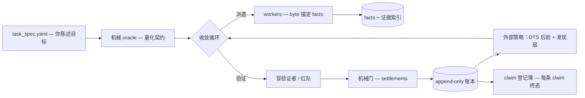

# kunglao-agent

**一套自主逆向工程代理：无人值守连跑数小时，每条结论独立验证，只有当每个答案都扛过机械 oracle 判决后才收敛交卷。**

[](https://github.com/amd2g2zz/kunglao-agent/releases)
[](https://github.com/amd2g2zz/kunglao-agent/actions/workflows/release-check.yml)
[](https://www.python.org)
[](https://claude.com/claude-code)
[](LICENSE)

**🧠 自主规划路径** · **🔬 每条 claim 机器校验** · **⚖️ 全程盲验证** · **📈 循环自己度量自己**

🚀 快速开始 · ✨ 工作原理 · 🖥️ 运行实况 · 📖 实战案例 · 🧪 评估实测 · 🏗️ 架构 · 🗓️ 路线图

[English](README.md) · **简体中文**

> **术语约定**：`kunglao-agent`、`PROVEN`、`oracle`、`RLVR`、`DTS`、`fact`、`claim`、`MCP`、`task_spec.yaml`、`claim-register.yaml`、`evidence/_index.json` 等术语保留英文原文。

---

## 📖 它是什么

你给 kunglao-agent 一个目标和待解问题；它自己规划路径、派遣专家
worker、独立验证每条结论，只有当每个答案都被机械检查落定（而不是
模型自说自话）时才停下。

目标光谱完整：Windows/Linux 原生二进制、Android APK（含 native
`.so` 层）、Web/JS、协议还原、固件 —— 静态优先设计，驱动你环境里
已有的执行通道（VMware、ssh、docker、adb；纯静态任务一个都不需要）。

它以 [Claude Code](https://claude.com/claude-code) 插件形式分发：
Claude Code 是对话界面；产品本体是这套循环和它产出的 fact 库。

> [!NOTE]
> 循环上报的每个数字 —— 胜率、后验、预算 —— 都能追溯到一条 append-only
> 账本行。没有任何数字是自声明的。

---

## 🖥️ 运行实况

**编排者工作现场** —— 一次收敛判决、一次带预算的 worker 派遣（facts
实时落盘）、一次盲红队判决把 claim 推进到 `PROVEN`；状态栏 HUD 让整
个交战过程一目了然：


**循环度量自己** —— 由 settlement 合成的回合策略、带删失结局仲裁的
折扣 Thompson 后验库、发现层准入一个真正的新方法臂（并拒绝改名重
试）、以及胜率曲线：


---

## ✨ 工作原理

三个想法承担全部工作；深度设计在 [`docs/design/`](docs/design/)，不在这里。

**1. 机械 oracle 落定一切。** 完成判据从你陈述的任务机械推导：可运行
检查的量化契约（byte-exact 回放、留出探针对、金丝雀往返）。任务写得
含糊，oracle 就含糊 —— 所以把任务写清楚本身就是使用方法的一部分。
没有任何人类给输出打分；oracle 判决是唯一通货。

**2. 没有任何东西凭作者自己的话变成 `PROVEN`。** 专家 worker 采集
byte 锚定的 facts；独立验证者盲重推每条 claim（checker 永远看不到
maker 的推理）；机械门落定 settlement。facts 引用原始产物（路径 +
sha256）并携带 `reproduce:` 命令。

**3. 模型冻结，循环自学。** 每次派遣/结算落 append-only 账本；折扣
Thompson 后验层按"什么方法在相似状态上真的有效"重排方法族；当已试
词汇表塌缩时，发现层生成新攻击假设（特征键控 novelty —— 改名重试
永远不算新）。离线对照器（SNIPS）让策略对 uniform 和 ε-greedy 对照
保持诚实。

---

## 📋 环境要求

| 组件 | 要求 | 说明 |
|---|---|---|
| Claude Code | 当前版本 | 运行时 —— 以插件安装 |
| Python | 3.10+ | 插件通过 `uv` 携带锁定环境 |
| `uv` | 任意较新版本 | `pip install uv` 或 [astral.sh/uv](https://astral.sh/uv) |
| Ghidra 或 IDA | 二选一 | 原生目标的反编译 |
| MCP 服务器 | 必装 2 个 | `ghidra` + `sequential-thinking` —— 见[工具链](#️-按目标分工具链) |

> [!WARNING]
> 分析动作会运行真实工具，可能执行目标派生的输入。动态工作使用隔离
> VM/设备；只分析你有授权的目标。

---

## 🚀 快速开始

### 1. 安装插件

```
/plugin marketplace add amd2g2zz/kunglao-agent
/plugin install kunglao-agent@kunglao-agent
```

### 2. 初始化工作区

```
/kunglao-agent:init ~/cases/synth-dropper --type windows
```

`kunglao-init` 搭建工作区、按 `--type` 探测工具链；缺必需工具时
HARD 拒绝并给出修复指引。

### 3. 陈述任务并开始

```
/kunglao-agent:analysis ~/cases/synth-dropper
> 目标：确认这个 dropper 的持久化机制和网络端点；每条结论必须可从
>   原始证据复现。
> 验证：关键结论只有在独立验证者盲推得到相同答案时才算数。
> 约束：静态优先；绝不在宿主机上执行样本。
```

把任务写得让独立评审者能判断结果：分析目标、验证逻辑、约束。一切
记入 `task_spec.yaml`；之后循环自动驱动 —— 可以走开，死掉的 worker
会被替换、问题重新入队，`/kunglao-agent:resume` 在任何中断后从盘上
状态重建现场。

### 4. 读交付物

```
claim-register.yaml   # 每条 claim 终态，带验证者签核
facts/F<NNN>.md       # byte 锚定、可复现、frontmatter 契约
evidence/_index.json  # 每条 fact → 原始产物（sha256 + 路径）
runs/                 # 会话审计轨迹
```

### 命令

| 命令 | 何时用 |
|---|---|
| `/kunglao-agent:init <ws> [--type …] [--lane …]` | 开始一次交战 |
| `/kunglao-agent:analysis <ws>` | 陈述任务并运行循环 |
| `/kunglao-agent:resume <ws>` | 任何中断之后 —— 只读断点简报 |
| `/kunglao-agent:upgrade <ws> [--dry-run]` | 插件升级后（用户数据永不触碰） |

`uv sync` 还会注册 `kunglao` 控制台脚本（`decide`、`tick`、`verify`、
`health`、`resume`、`upgrade`……全部子命令上 PATH）。

---

## 📖 怎么写任务描述

循环从你陈述的最终状态机械推导 oracle。四种说法覆盖大部分偏差：

| 你说 | 通常意味着 | oracle 锚定在 |
|---|---|---|
| "我要纯算" | 离线复现签名/加密例程 | 每对捕获样本（含留出对）byte-exact 回放 |
| "我要解密" | 解一段密文，还是要可复用能力？ | 明文校验通过 / 金丝雀往返 byte 一致 |
| "帮我分析这个协议" | 线格式还原 + 可运行编解码器 | 编解码器对每帧 byte-exact 往返 |
| "这个 sign 在哪算的？" | 一个带证明的定位 | 具名函数 + 该点 hook 复现捕获值 |

点名样本和行为（不是类别）；让成功标准是数据（捕获对 —— 留出对保
证诚实）；约束前置说清（纯静态？有设备？走哪个通道？）。

---

## 🧰 你看的运行面

两个实时面让运行可观察：

**状态栏** —— 运行中的一行 HUD：语义状态字形（`◈ analyzing` /
`✖ DOWN`）、claim 进度 `C 6/8`、当前胜率、采样器榜首臂及其年龄、健
康度圆点、活动任务片、价值火花线。过期但在策略内如实渲染 idle；超
策略渲染 DOWN。

**胜率曲线** —— settlement 流上的滚动通过率：

```bash
uv run python scripts/winrate_curve.py <workspace> [--window 5] [--html curve.html]
```

健康运行的曲线随循环学会"哪些方法有效"而上升；贴零的平线说明排序
器把预算花在了永不结算的臂上 —— 先查障碍注册表再加预算。

---

## 📚 实战案例

脱敏的一页战斗报告 —— 防御面、走过的路径、机械判决：

- [加固 Android native crackme](docs/cases/hardened-android-crackme.md) —— 14 层保护；无人值守运行，3/3 常量，18/18 byte-exact 回放。
- [Web 请求签名还原](docs/cases/web-request-signing.md) —— 在混淆与反爬防御下 byte-exact 复现生产签名方案。
- [桌面代理许可证协议](docs/cases/desktop-agent-license.md) —— challenge/response 握手完整刻画并 byte-exact 回放。

每篇案例在中英双语版本并存于 `docs/cases/`。

---

## 🧪 评估与实测结果

构造目标带机械 oracle 和构造已知的 ground truth；checker 铸造候选从
未见过的留出探针。内置 12 单元 L1 矩阵（跨 JS / x86/ARM64 ELF /
Windows PE 的静态 RE 目标；只认 byte 锚定交付物、无部分分、pass@1、
按会话限额）：

| 运行时 | pass@1 | 会话成本 |
|---|---|---|
| kunglao v0.1.5.post2 | 5/12 | ~$135 总计（13 会话） |
| kunglao v0.1.6 | **11/12** | ~$120 总计（4 轮治理迭代） |
| 裸 Claude Code | 12/12 | ~$11.4 总计 |

诚实解读：这 12 个单元是单会话可解的，前沿模型 + 默认工具最便宜地
刷满 —— kunglao 的差异化在**长时程多层工作、验证纪律（每条 claim 都
有 oracle + 盲红队）、动态通道**，不在单会话速度。长时程矩阵与五臂
对照（裸 CC / CC+热上下文 / kunglao 冷 / kunglao 热 / 去召回消融）
随本发布列车落定。

对照臂 A/B 与回放标尺（离线排序器质量测量）以命令随附：
`scripts/eval_control_arm.py --ab`、`scripts/replay_ruler.py <ws>`。

---

## 🏗️ 架构


```mermaid
flowchart LR
    Task[task_spec.yaml — 你陈述目标] --> Oracle[机械 oracle — 量化契约]
    Oracle --> Loop{收敛循环}
    Loop -->|派遣| Workers[workers — byte 锚定 facts]
    Loop -->|验证| Verifier[盲验证者 / 红队]
    Workers --> Facts[(facts + 证据索引)]
    Verifier --> Gates[机械门 — settlements]
    Gates --> Ledger[(append-only 账本)]
    Ledger --> Policy[外部策略：DTS 后验 + 发现层]
    Policy --> Loop
    Ledger --> Report[claim 登记簿 — 每条 claim 终态]
```

每次交战一个工作区（init 搭建；钩子在工作区级接线 —— 你的全局
`~/.claude/settings.json` 永不被写）：

<details>
<summary><strong>工作区布局</strong></summary>

```
<workspace>/
├── bins/<sha256>        # 样本（gitignored）
├── task_spec.yaml       # 目标 / 验证逻辑 / 约束
├── claim-register.yaml  # claims C-NN 与状态
├── facts/               # byte 锚定 facts F-NNN.md + _INDEX.md
├── evidence/            # 原始产物 + _index.json（路径 + sha256）
├── runs/                # 账本、worker 状态、心跳
├── blockers/            # 失败归因记录
└── CLAUDE.md            # 工作区规则（生成）
```

</details>

<details>
<summary><strong>按目标分工具链</strong></summary>

所有类型必装两个 MCP 服务器：`ghidra` 和 `sequential-thinking`。
随时探测：`uv run python scripts/mcp_probe.py <ws> --type <t>`（退出
码 1 = HARD 缺失）。

- **windows** —— pefile、die、floss、Ghidra/IDA；动态需 VMware+vmr-shell 或 ssh/docker；frida-server
- **linux** —— binutils（file/readelf/objdump）、Ghidra/IDA；动态走 ssh-mcp 控制面
- **android** —— aapt、jadx、apktool、gitnexus、adb + root 设备、frida-server（native `.so` 需 Ghidra）
- **web** —— camoufox-reverse MCP（必装，随插件分发）；docker 默认通道
- **macos** —— Xcode CLT 工具；ssh 通道到 Mac 宿主

动态工作需要一个执行通道（`KUNGLAO_CHANNEL`）：`vmr`（VMware）、
`ssh`、`docker`、`adb` —— 或 `local`（**纯静态**；红线：绝不在宿主机
执行样本；动态任务在 `local` 上 HARD 拒绝）。

</details>

<details>
<summary><strong>MCP 供给清单</strong></summary>

单一来源：`scripts/mcp_probe.py` —— ghidra（HARD）、
sequential-thinking（HARD）、x64dbg（Windows T3）、volatility
（WARN）、ida-pro-vm（WARN）、gitnexus（Android HARD）、ssh-mcp
（WARN）、virustotal（WARN）、camoufox-reverse（web HARD）。注册命令
随探测输出打印。

</details>

---

## 🗓️ 路线图

- 留出语料上的五臂能力矩阵（裸 CC vs CC+热上下文 vs kunglao 冷/热/去召回消融）
- 已发现方法臂的注册表准入 —— 让新方法可被派遣
- 跨工作区记忆：什么方法在哪类状态有效，特征键控
- blocked-path 测量语料 —— 量化"超越历史的发现"

---

## 🔐 安全

仅限授权分析。你负责定义和执行允许范围；沙箱边界降低风险但永远替代
不了宿主隔离；软件按"现状"提供。

---

## 🧪 开发

```bash
uv sync                 # 锁定环境
uv run pytest -n 4      # 测试套件（CI 跑全矩阵）
uv run ruff check .     # lint
```

CI 门禁每个 PR：卫生账本（注释 / 静默异常 / 正式代码标记）、部署清单
一致性、单元 + 集成两档。

---

## 📝 许可证

双重许可：个人、学术与内部使用 **AGPL-3.0**（见 [LICENSE](LICENSE)）；
闭源分发需商业许可 —— 联系维护者。
