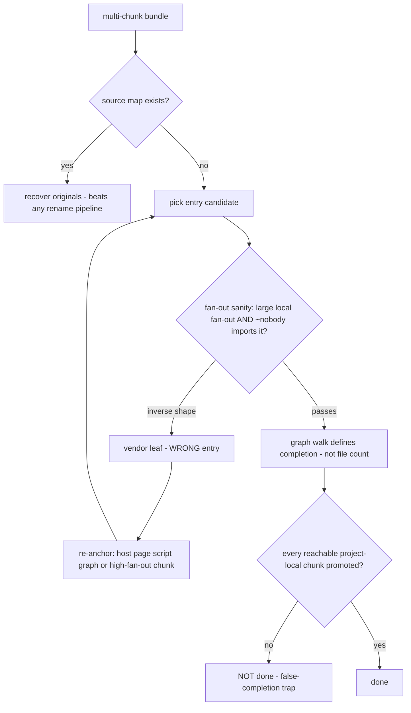

# Peel ordering & family adapters (external-distilled)

> External-derived methodology (never directly PROVEN). Generalized paraphrase;
> provenance = S-id list above. The peel LOOP (inspect → route → transform →
> re-inspect) and the bundler/obfuscator routing table are web-re-quickref's;
> this card lands what happens INSIDE a pass chain and how per-family residue
> is engineered, which the loop card does not cover. Advisory: ordering
> violations do not error — they silently no-op or mangle, which is worse.

## The pass-ordering contract

One question first: *what input shape does the next pass expect?* Each pass
consumes the shape the previous one produced; the contract makes that
explicit as ordered groups with the rule in the comment:

```text
// unwrap execution-form FIRST — packed input is one giant CallExpression; AST passes starve
unpack (Packer/AAEncode/URLencode classes, iterate until no layer matches)
// resolve the string table BEFORE literal passes — decoders then walk only used literals
string-array inline (rotation wrapper intact)
// fold AFTER resolution — folding first mangles the rotation wrapper's shape
decode-literals + constant fold + dead-branch removal
// structural report LAST — fake-branch residue must fold out first, or the report is noise
control-flow report (read-only)
// cross-cutting assertions:
assert positions_rederived after EVERY byte-rewriting pass   # old offsets/ids are stale
assert detect() re-run after EVERY unwrap                    # the detector picks the next pass
assert each pass try/except-wrapped + standalone-runnable    # one failure must not abort the chain
```

**Decoder-indirection escape hatch** — when string-table access is wrapped in
a decoder function, direct inlining fails:

```text
if access is `_tbl = function(i){ return arr[i-0x10]; }` shape:
    inline the small wrapper functions first (simplify pass)
    then RETRY the string-table pass      # ordered retry, not "unrecoverable"
```

**Eval-safety gate** — unwrapping packed input executes it by construction
(the decoder runs):

```text
rule: sandbox-isolate the unwrap pass, or offer an explicit no-eval refusal
      mode (input unchanged, refusal recorded). Never unwrap unvetted input
      in a privileged runtime.
```

## Residue metrics drive the adapter layer

Generic passes stay generic (structure normalization, dead-branch removal,
constant folding); family quirks live in separate adapter passes, and the
separation is enforced by evidence:

| Rule | Statement |
|---|---|
| measure the residue | after the generic chain, count undigested symptoms (string-table access patterns, flat dispatch remains, opaque predicates, obfuscator-name density) — the residue profile IS the family fingerprint |
| graduation | pattern recurs across unrelated samples → family adapter (rule doc + detector signature + targeted script + pipeline entry); a one-sample quirk stays a one-off script, never the generic chain |
| cost | high-cost passes run only where the family needs them (literal inlining late on a huge sample stalls the chain); families that don't need a pass skip it |
| integrity | every structural rewrite must re-parse cleanly; every pass runs standalone (a chain that only works end-to-end is undebuggable) |

Why evidence-gated graduation: site-specific logic accreting inside generic
passes is how deobfuscator chains rot — the adapter boundary keeps the
generic chain auditable while family knowledge still accumulates.

## Entry selection & the false-completion trap

For multi-chunk bundles, choosing WHERE to start has its own failure mode —
a >3-level ladder with a trap at its first branch:



Why the trap needs a named rule: restoring from a transitive vendor leaf
yields a small closure that LOOKS complete — everything touched resolved,
nothing missing — while the real application tree sits unexplored. "Everything
I touched resolved" is not "the tree is done". The fan-out algebra:
`real entry ⇔ large local fan-out ∧ ~nobody imports it`; a vendor leaf is the
exact inverse.

Companions: [web-re-quickref.md](../labs/web-re-quickref.md) (peel loop +
routing table), [jsvmp-triage.md](../vm/jsvmp-triage.md) (VM boundary stop
condition), [vm-deobfuscation-routing](../../patterns/vm/vm-deobfuscation-routing.md)
(lane gate).

## Tool section — mechanical entry detection & routing (registered CLI)

The entry-selection step above has a registered CLI:
`tools/web/js_obfuscation_detect.py` (tag `js:obfuscation-detect`).
Reach for it when: a raw bundle arrives and the peel order is undecided —
detect before the first transform, and let the route pick the entry.

```bash
python tools/web/js_obfuscation_detect.py bundle.min.js
# recommendation.route = unpack-first         -> packer bootstrap
#                      = unbundle             -> bundler markers
#                      = webcrack-deobfuscate -> string-array/CFF family
#                      = vmp-triage           -> confirm with jsvmp_triage
#                      = sandbox-decode       -> self-decoding payload
```

The route names are the peel-order decisions of this card, emitted
mechanically with per-technique count evidence. Falsifier: a
`direct-read` route while `_0x` identifiers sit on disk means the
detector missed — widen fixtures before trusting clean verdicts.
