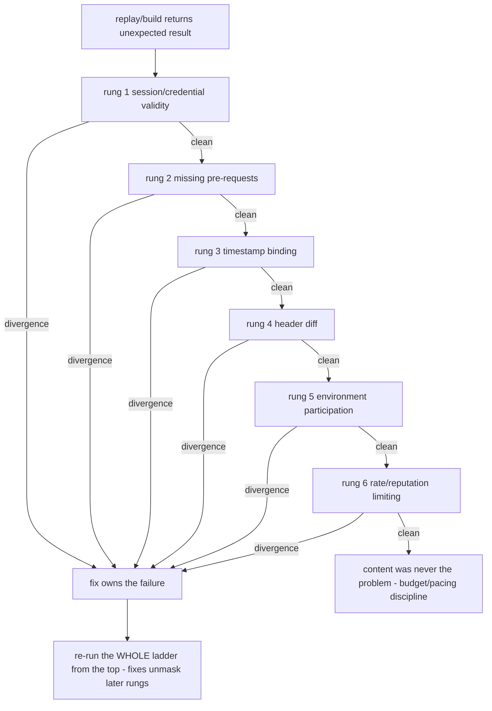

# Protocol-failure ladder (external-distilled)

> External-derived methodology (never directly PROVEN). Generalized paraphrase;
> provenance = S-id list above. Our trigger→observe→attribute loop localizes
> WHICH field a blocker reads; this card covers the other failure class — the
> replay/build that returns an unexpected result — and imposes a fixed
> diagnostic ORDER. Advisory: the order is the method; the exit rule is
> mechanical — the first rung producing a DIVERGENCE owns the failure.

## The ladder (climb in order)

One question per rung: *what did this check compare, and what would a
divergence prove?* One variable per step; each step carries its own check and
evidence.

| Rung | Check | Evidence | Divergence means |
|---|---|---|---|
| 1 session/credential validity | jar diff vs a fresh live session; HttpOnly members (invisible to document.cookie); status drift 401/redirect-to-login | jar diff, status-distribution over time | expired identity, missing jar members, dead login state |
| 2 missing pre-requests | full-sequence capture vs the script's request list | page-sent-but-script-did-not list | a pre-request's response carries the token/seed the target consumes |
| 3 timestamp binding | unit (s vs ms), float truncation, signed-ts == carried-ts, validity windows | intermittency near a window boundary is itself evidence | two timestamps generated microseconds apart both entering the computation |
| 4 header diff | field-by-field vs a captured success; then prune from the full set until failure | subtraction proves necessity | missing content-type family, client hints, custom X-headers, accept-encoding promises the client cannot keep |
| 5 environment participation | hook candidate reads; diff requests computed with/without each value | participation map per value | expensive env-stubbing without participation evidence is guessing |
| 6 rate/reputation | slower human-scale pacing, diff; correlate with volume/identity age | outcome changes with pacing | content was never the problem — switch to the budget/pacing discipline (web-crawler-engineering) |

Rule: blind large rewrites are forbidden — a rewrite that "fixes" the symptom
destroys the attribution evidence the next failure will need.

## Mismatch-first check order (post-fix regression)

When a corrected build still mismatches, audit in this order BEFORE touching
the algorithm — each entry answers a different "is the comparison even
valid?" question:

| # | Check | Failure it names |
|---|---|---|
| 1 | capture baseline identity | comparison across different profiles |
| 2 | dynamic-resource freshness | stale bundle/challenge/seed (resources expire; refresh in-session) |
| 3 | cookie/storage state | drifted session state |
| 4 | request ordering + session lifecycle | sequence-dependent verification |
| 5 | transport/session identity | TLS-class fingerprint, session reuse |
| 6 | evidence truncation | the "expected" side itself incomplete |
| 7 | automation exposure | a leak the fix introduced |

The algorithm is the LAST suspect: a verified algorithm does not stop
verifying because its callers drifted.

Companions: [web-risk-control.md](../risk-control/web-risk-control.md)
(detection-point attribution), [web-crawler-engineering.md](../crawler/web-crawler-engineering.md)
(pacing/budget discipline),
[external-algorithm-recovery-chains.md](external-algorithm-recovery-chains.md)
(first-deviation walk inside the computation).
